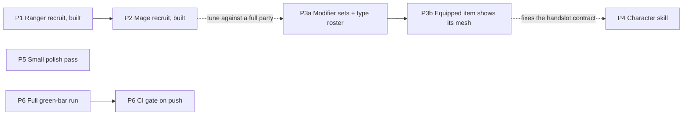

# Sir Fish — Backlog

> **Status: prioritised 2026-09-13, nothing scheduled; P5 added 2026-09-14; P1 built
> and live-playtested 2026-09-14.** Five ideas plus one spike, ranked. Each section
> records what already exists (checked against the code on `biome-frames-town`), what
> is missing, and what is decided or still open. The P3 and P4 decisions were settled
> in review the same day, and spike S1 was run the same day (§4). P5 is an unscoped
> list of small polish items queued during a later session. P1's machinery is built,
> tested (headless and live), and its live playtest caught a real combat-loop bug
> (heroes other than the DAMAGE executor never had a visible action) that's now fixed
> - what's left is the balance re-tune §1 flags. P6 was added 2026-09-19 alongside
> `tools/run_tests.py`. **P2 turned out to already be built** - a same-day follow-up
> commit on 2026-09-14, undocumented here until 2026-09-20 - and that audit found and
> fixed two regressions the follow-up commit had silently introduced into P1 (§1
> "Found and fixed"). §7 collects every decision with its status.

---

## 0. Priority at a glance

| # | Idea | Player value | Effort | Blocked by | Why this position |
|---|---|---|---|---|---|
| **P1** | ~~Ranger recruitment quest, offered from level 3~~ | High | M | nothing | **Built and live-playtested 2026-09-14; two regressions found and fixed 2026-09-20** - unlock gate, one-shot tracking, `CollectObjective`, `RecruitRewardExtra`, the quest resource, headless- and live-tested. The playtest caught and fixed a real combat-loop bug (§1). A same-day follow-up commit (P2) had silently dropped the unlock gate and left the ranger's own objective non-functional; both restored. The two-hero balance re-tune is still open |
| **P2** | ~~Mage recruitment quest, offered from level 5~~ | High | S | nothing | **Built 2026-09-14, same day as P1 - undocumented here until this audit.** Deviated from the plan below: a single static authored RELIC (`Item.Kind.RELIC` + `QuestDef.guaranteed_boss_drop`), not a dynamically-generated weapon, and no level-5 gate (mirrors `easy.tres`'s pacing instead). Its own `_load_authored_quests()` rewrite is what caused P1's regressions |
| **S1** | ~~Spike: does KayKit's `Rig_Medium` match the shipped rig?~~ | — | XS | — | **Done 2026-09-13: it matches** (§4) |
| **P3** | Four-modifier sets per item type; item types for every shipped hand mesh | Medium | M data + M visible props | P1–P2 for tuning | Loot for three classes can only be tuned with three classes in the party |
| **P4** | Prompt → Meshy → Blender → glb character skill | Medium | M | nothing: the trial character proved the route (§4) | What remains is packaging `rig_bandit_officer.py` as a skill and building 4.3's shared clip source |
| **P5** | Small polish pass: post-expedition summary, chest presentation, slot upgrade UI, party modal info, shadow monster rework | Low–Medium | S (each item) | nothing | Queued during a later session; not yet scoped against P1–P4 |
| **P6** | Make the headless suite a real gate: one full green-bar run, then CI on push | — (dev) | S | nothing | 29 suites exist and nothing runs them automatically. `tools/run_tests.py` (2026-09-19) exits non-zero on failure precisely so it can gate |

Solid arrows are hard dependencies. Dashed arrows are "better after".

---

## 1. P1 — Ranger recruitment quest (offered from level 3)

### The idea

Once the party reaches level 3, the mayor's board offers a one-off quest to retrieve a
specific item. Bringing it home adds the ranger to the party.

This is the parked `content-phase-1/Sir Fish - Recruitment Quest Acceptance Test
Outline.md` plus a level gate. Read the outline first. This section only covers what
has changed since it was written and what the build needs.

### Already in place

- **The ranger is complete as data.** `resources/classes/ranger.tres` (executes
  `DAMAGE_ALL`; item types `bow`, `dagger`, `helm`, `ring`), `resources/stats/ranger.tres`,
  `ranger_rig.tres`, both abilities, and `scenes/battle/heroes/ranger.tscn` on the
  KayKit `rogue.glb`.
- **The party is multi-hero safe** (Content Phase 0 Step 5). `new_profile()` starts
  `active_party` as the warrior alone on purpose, and its comment says the others join
  "through a future recruit mechanic".
- **`QuestRewardExtra` exists** with `grant()`, `describe()` and a save registry, and
  has zero subclasses.
- **`QuestObjective` exists** with two kinds, `ClearEncountersObjective` and
  `SlayObjective`.
- **`GameState.hero_level()` with no argument returns the party's best level**, which
  is the right reading of "the player reaches level 3".

### What has changed in the outline

- **§5.8's blocker is cleared.** Phase 1 Step 2b moved item eligibility onto
  `ClassDef.item_types`, so a recruit can wear armor and trinkets.
- **§5.7 is half stale.** Since the day/night cycle was scrapped the inn charges a flat
  `INN_NIGHT_COST`. Only `meal_cost()` still multiplies by party size, and
  `test_economy.gd` has no party-size references left.
- **§6 criterion 8 ("no code was edited") cannot hold for the first recruit.** The
  machinery below is code. It should hold for the *second* recruit, which is what
  makes P2 the real test.

### What was built (2026-09-14)

All six items below landed in one pass, verified with the existing headless suites
(`test_content_registry`, `test_quest_flow`, `test_quest_objectives`, `test_quest_gen`,
`test_quest_generator`, `test_profile_save`, `test_economy`, `test_inn_recovery`,
`test_autoload_safety`, `test_profile_expedition` - all green) plus a 28-check scratch
smoke test exercising the whole flow end to end (gate closed at level 1, opens at level
3, `CollectObjective` completes on the boss encounter, `RecruitRewardExtra.grant()`
adds the ranger with an auto-equipped bow + helm at the party's level, a second
`grant()` is a no-op, `completed_quest_ids` retires the quest, and both round-trip
through a save).

1. **The unlock gate.** `QuestDef.unlock_level` (default 1, so every existing quest is
   unaffected) and `QuestDef.one_shot` (default false). `mayor_office.gd`'s
   `_load_authored_quests()` now skips a quest below `GameState.hero_level()`, and
   skips a `one_shot` quest whose id is already in `completed_quest_ids` - both filters
   drop the quest from the list entirely, distinct from `level_range`'s underlevelled
   *tint*, which still lets an available quest through early.
2. **`GameState.completed_quest_ids`**, profile-scoped, cleared by `new_profile()`.
   Persisted **additively** rather than with the `SaveGame.VERSION` bump this section
   originally called for - it's a new key with a sensible empty-array default on an
   old save, the same shape `hero_levels`/`quest_board`/`forge_stock` already use, so
   `save_game.gd`'s own version policy ("bump on a meaning change, never merely to add
   a key") says no bump is needed. `RunController._run_complete()` appends the quest's
   id on victory, alongside gold and the reward extras, guarded idempotent.
3. **`RecruitRewardExtra`** (`scripts/data/reward_extras/recruit_reward_extra.gd`), the
   first concrete `QuestRewardExtra`. Exports `class_id`, `weapon_type`, `armor_type`.
   `grant()` appends `class_id` to `active_party` only if absent (idempotent), then
   generates the weapon (Magic rarity - a named prize, not a random find) and armor
   (Common) at the party's level and adds them, which auto-equips into the recruit's
   empty slots via the existing `_maybe_auto_equip()` path. `describe()` reads "Joins
   the party: Ranger". Registered in `QuestRewardExtra.from_dict()`; the base class
   also gained the `_to_dict_extra()`/`_from_dict_extra()` hook pattern its own header
   already promised, mirroring `QuestObjective`'s.
4. **The starting kit** rides inside `grant()` (point 3) rather than being a separate
   step - see decision 1.2 below for why weapon + armor, not weapon alone.
5. **`CollectObjective`** (`scripts/data/objectives/collect_objective.gd`), registered
   in `QuestObjective.from_dict()`. See decision 1.1 for its exact trigger.
6. **A balance check is still open.** No enemy or level-building code reads party size,
   and `test_level_curves.gd` is explicit that its sim assumes "Party size is 1 (the
   solo warrior, matching active_party's real starting value)". A second hero is a
   straight power jump the sim harness doesn't model yet. This needs a design call
   (how the harness should represent a two-hero bag, not just a re-run) rather than a
   mechanical follow-up, so it's left for whoever tunes P1's actual numbers before
   shipping it to players.

The ranger recruitment quest itself is authored at
`resources/quests/ranger_recruit.tres` ("The Ranger's Bow", `unlock_level = 3`,
`one_shot = true`, boss `bandit_officer`, reward `recruit_ranger.tres`).

**Live-played, and it surfaced a real bug - not in P1's own code, but in the combat
loop P1 was the first thing to ever actually exercise with two heroes.** Reported as
"the ranger joins but the slot has no icons for her, so she never does anything in
combat." Traced to `slot_machine.gd`/`battle_director.gd`: heroes have never acted on
their own cooldown (`request_turn()` flatly returns for a hero) - the *only* hero who
ever gets a personal attack animation is whoever `_executor_for(Kind.DAMAGE)` picks
for the pooled `_hero_swing()`, which today is always the warrior. `DAMAGE_ALL`
(Chain) icons resolved as an impersonal lightning bolt ("source is null on purpose")
and `HEAL` icons healed the lowest-HP hero with no caster animation - so no class
other than the DAMAGE executor has ever had a visible action in combat. Invisible with
a solo warrior; guaranteed to surface the moment a second hero exists, exactly as the
recruitment outline's own §2 predicted ("grows `active_party` from one to two, the
single event most of the current code was never exercised against").

**Fixed 2026-09-14.** `Combatant.slot_gesture()` is a new, purely cosmetic swing
(bypasses `begin_action()`/`Ability` entirely, so it can never double-deal damage) that
plays the hero's own `attack` clip without resolving anything itself.
`SlotMachine._resolve_icon()` now calls it on `_executor_for(kind, false)` - a new
`fallback` param so this NEVER lands on the generic first-living-hero fallback, only a
class that actually owns the kind, which keeps it from ever colliding with a real
`_hero_swing()` on the same hero. Verified live: forced the board to a `slot_bolt`
(Chain) icon mid-combat with the real ranger recruit in the party and confirmed she
plays her real `attack` animation instead of standing idle. All of `test_executor`,
`test_slot_odds`, `test_ability_resolve` and `test_animation_clips` still pass.

**Still open, deliberately out of scope for this fix:** if the party ever has zero
`DAMAGE_ALL`/`HEAL` icons anywhere in its combined gear (plausible - it's 1 of 7
weapon/trinket modifiers), the owning class's gesture simply never fires this spin,
same as before - this fix makes her animate *when the icon kind she owns lands*, it
does not guarantee that kind lands. A future pass could force one such modifier onto
a fresh recruit's starting gear (`RecruitRewardExtra`, mirroring `new_profile()`'s
forced `dmg_flat` on the warrior's starter weapon) if recruits going quiet for a
while turns out to still read badly in practice.

### Decisions (built 2026-09-14)

**1.1 Is the retrieved item a real `Item` during the run?** *Decided: no* - superseded,
see "Found and fixed" below. Originally: tracked as objective progress, `CollectObjective`
completing when the quest's boss encounter resolves (the same `encounter_resolved` event
`ClearEncountersObjective` reads, filtered to `def.is_boss`), with `RecruitRewardExtra.
grant()` creating the real item only at victory - avoiding two hazards the outline found:
`Item.slot()`'s unknown-type fallback (§5.1) and `discard_expedition_loot()`'s wipe sweep
(§5.2). **What actually ships (as of the P2 commit, 2026-09-14): the opposite answer.**
The item IS a real mid-run `Item`, of a new `Item.Kind.RELIC`, guaranteed to drop from the
quest's boss (`QuestDef.guaranteed_boss_drop`, bypassing `_roll_drop()`'s RNG entirely);
`CollectObjective` completes on the `item_added` event once the relic's own
`target_weapon_type` is seen, not on `encounter_resolved`. Both original hazards are
avoided a different way instead: the relic's `weapon_type` gets its own real
`Itemizer.ITEM_TYPES` row (so `Item.slot()` never falls through to the unknown-type
default), and `Kind.RELIC` is exempted from `discard_expedition_loot()`'s wipe sweep by
kind, not by tracking the token as non-existent. This is a strictly more robust design
(the objective tracker now shows real progress, and the token itself survives a wipe
rather than never having existed) - see "Found and fixed" for why the ranger's own
resources didn't carry it until 2026-09-20.

**Not built**: a distinct "pickup beat" VFX at the moment of retrieval, or a dedicated
line on the result screen calling the item out by name - `RecruitRewardExtra.describe()`
covers the reward row generically ("Joins the party: Ranger"). Worth a P5-style polish
pass, not a blocker.

Failing the quest before the boss falls just loses the progress - `start_expedition()`
always duplicates a fresh, zeroed `CollectObjective`, and the boss is always the last
encounter, so a wipe can only happen before the relic ever drops. A wipe can no longer
happen after it drops: `guaranteed_boss_drop`'s `item_added` completes the objective
immediately, which ends the run in victory before any further encounter could wipe the
party - the retrieved-item design closed off the case the original sentence here was
hedging against.

**1.2 What does the recruit start with?** *Recommend: the retrieved item is the
recruit's weapon.* The quest is to recover the ranger's lost bow, and the ranger
arrives with it equipped, plus a Common armor piece the way `new_profile()` equips the
warrior. That answers both the outline's §5.4 (is the token consumed?) and the
unarmed-recruit problem. **What actually ships: no armor piece.** `RecruitRewardExtra`
only ever searches inventory for an existing item matching `token_weapon_type` and
equips it if found (silently joining bare-handed if not) - there is no dynamic
generation of a Magic weapon or Common armor at grant time. The armor half of this
decision was never built for either recruit.

**1.3 What level does the recruit join at?** *New question; the outline does not cover
it.* `hero_levels` treats a missing entry as level 1. A ranger recruited by a level-4
warrior would join at level 1, and because every member receives the full
`expedition_xp`, it would trail by the same XP forever. *Recommend joining at
`hero_level()`, the party's best.*

**1.4 When does the recruit join?** The outline's §5.3 recommendation stands.
`grant()` already runs only on victory, and `_reset_hero_runtime()` rebuilds the party
from `active_party` at the next `start_expedition()`. So the recruit is in the party
when the player gets back to town, with no live-combat spawning needed.

### Found and fixed (2026-09-20)

This audit set out to start P2, and found it already built (§2) - which meant checking
whether it actually still agreed with what P1 shipped six days earlier. It didn't, in
two ways, both traced to the mage commit (`7bfae68`) rewriting the same shared files
P1 had just built, apparently developed in parallel without P1's changes and never
reconciled against them:

1. **The unlock gate silently disappeared.** `bc9b70d` (P1) added the `unlock_level`/
   `one_shot`/`completed_quest_ids` checks to `mayor_office.gd::_load_authored_quests()`
   described in point 1 above. `7bfae68` (P2), the same evening, rewrote that same
   function to add `_already_recruited()` - but its version of the function was a plain
   `if res is QuestDef: out.append(res)`, with no unlock_level/one_shot logic at all,
   silently dropping both checks. The ranger recruitment quest has been offerable from
   level 1, not level 3, ever since, and any future `one_shot` quest that isn't also a
   recruit would never retire. Caught because `tests/test_quest_generator.gd`'s
   `_check_authored_quest_order` - written the same evening, correctly assuming the gate
   was still there, and simply never run until this audit (it's one of the eight suites
   `tools/run_tests.py` turned up as never having a recorded pass; see P6 §6.1) - asserts
   exactly the 4-quest, gate-respecting list this regression breaks. **Fixed**: restored
   the two checks alongside `_already_recruited()`, which stays (it's still what retires
   `recruit_mage.tres`, which ships with neither field set - see §2).
2. **The ranger's own resources were never migrated to the relic design.** `7bfae68`
   also rewrote `collect_objective.gd` and `recruit_reward_extra.gd` wholesale for the
   mage's new design (decision 1.1's "what actually ships", above) - a real behavior
   change to a shared base class, landed without updating `ranger_recruit.tres`'s own
   `collect_ranger_bow.tres` (no `target_weapon_type`, so its `CollectObjective` could
   never legitimately complete - `is_complete()` needs an `item_added` matching a type
   that was never set) or `ranger_recruit.tres` itself (no `guaranteed_boss_drop`, so
   there was nothing authored for it to match against). The quest still worked in
   practice only because `_next_encounter()` has a second, independent path to
   `_run_complete()` when the encounter list runs out (the boss is always last) -
   the objective tracker just permanently read 0/1, and `RecruitRewardExtra` had no
   guaranteed item to find, so the ranger recruit's `token_weapon_type = &"bow"` could
   only ever equip an ordinary bow that happened to be sitting unequipped in inventory,
   joining bare-handed otherwise. **Fixed**: added `&"warbow"` to `Itemizer.ITEM_TYPES`'s
   authored-relics block (mirroring `heartstone`, but `Slot.WEAPON` - the ranger's own
   quest is specifically about recovering her bow), authored
   `resources/items/ranger_warbow.tres` (RELIC, level 9 - two above the quest's own
   band ceiling, mirroring `mage_heartstone.tres`'s level 7 against its band's ceiling
   of 5), set `target_weapon_type`/`guaranteed_boss_drop` on the ranger's own two
   resources, and updated `recruit_ranger.tres`'s `token_weapon_type` to match. Added
   `tests/test_recruit_ranger.gd`, mirroring `test_recruit_mage.gd`'s coverage, since
   nothing had exercised the ranger's own resource wiring before - the gap that let
   this drift six days without being caught.

---

## 2. P2 — Mage recruitment quest (offered from level 5)

**Built 2026-09-14, the same day as P1, one commit later (`7bfae68`) - complete with its
own dedicated test (`tests/test_recruit_mage.gd`, 2026-09-14) and a live-tested pacing
fix (see below). None of this was recorded here until the 2026-09-20 audit that started
this section, and that audit is also what found the two P1 regressions this same commit
introduced (§1 "Found and fixed").**

*Original plan, below, superseded by what actually shipped:*

- ~~**Should be resources only**: one `QuestDef` with `unlock_level = 5`, `one_shot`, a
  `CollectObjective`, and a `RecruitRewardExtra` whose `class_id` is `mage`. If any code
  has to change, P1's machinery was not generic enough; fix it there. This is the
  outline's criterion 8.~~ **Code did change** - `collect_objective.gd` and
  `recruit_reward_extra.gd` were rewritten for a new, more robust design (decision 1.1),
  not because P1's machinery was too narrow but because this one is a real improvement:
  a real, RELIC-kind mid-run item with a guaranteed boss drop, rather than P1's abstract
  "boss encounter resolved" progress tracking. `RecruitRewardExtra`'s fields are
  `hero_class`/`token_weapon_type`, not `class_id`.
- ~~**The retrieved item is the mage's staff.**~~ **It's the mage's TRINKET instead** -
  `resources/items/mage_heartstone.tres`, an authored `heartstone` RELIC resolving to
  `Item.Slot.TRINKET` (`Itemizer.ITEM_TYPES`'s own comment: "never rolled by any
  generator... no ClassDef lists these in item_types"). Decision 3.4 (shields to the
  warrior, tome to the mage) hadn't landed and still hasn't (§3 is still open) - this
  sidesteps it rather than depending on it.
- ~~**`unlock_level = 5`.**~~ **Not set - deliberately, unlike the ranger's `unlock_level
  = 3`.** `recruit_mage.tres` ships with neither `unlock_level` nor `one_shot`, and
  `test_quest_generator.gd::_check_authored_quest_order` explicitly asserts it appears
  in a fresh, level-1 profile's quest list. Retirement is via `_already_recruited()`
  alone (§1 "Found and fixed" point 1) - once the mage joins, the quest disappears
  regardless of `one_shot`/`completed_quest_ids`, so the level-5 gate this bullet
  planned for turned out not to be needed for correctness, only for pacing (see below).
- **Three heroes is a bigger step than two - already covered.** P1's `slot_gesture()`
  fix (§1, "Fixed 2026-09-14") is generic over `_executor_for(kind, false)`, not
  ranger-specific, so the mage's `HEAL` icon already animates her the same way. Not a
  P2-specific concern in the end.
- ~~**Pacing (rough estimate, not measured).**~~ **Superseded by a live-testing result.**
  The commit message: "Pacing mirrors easy.tres (5 encounters, level 1-5, a shop stop
  before the boss) after an early higher-level/shorter draft wiped a solo starting
  warrior in live testing." The quest shipped at `level_range = Vector2i(1, 5)`, not a
  level-5-gated band - which is also why `unlock_level` was dropped rather than set to
  5: a quest playable from level 1 doesn't need a level-5 door on it.

---

## 3. P3 — Modifier sets per item type, and item types for every shipped mesh

### Where it stands today

**Eleven item types**, defined in `Itemizer.ITEM_TYPES` and owned through
`ClassDef.item_types`:

| Class | Weapon | Armor | Trinket |
|---|---|---|---|
| Warrior | axe, sword | mail | idol |
| Ranger | bow, dagger | helm | ring |
| Mage | staff | shield | amulet |

**Modifiers are pooled per slot, not per type.** Each entry in `Itemizer.MODIFIERS`
lists the slots allowed to roll it. Weapons and trinkets share a pool of seven, armor
has two, and rarity sets how many an item carries: Common 0, Magic 1, Rare 2,
Enhanced 3 (`RARITY_MOD_COUNT`). As a result:

- **Armor cannot reach Enhanced without repeating a modifier.** Three forge rungs need
  three distinct picks from a pool of two, so `_modifier_pool_excluding()` falls back
  to a repeat.
- **Type carries no modifier identity.** A sword and a dagger, or a weapon and a
  trinket, roll from identical pools.
- **Enhanced's third icon is locked at the top of its range**
  (`FORGE_ICON_POWER_MAX`, 175% of Power) and carries the `enhanced` marker the UI
  tints.

**Equipping an item never changes the model.** Prop meshes are hidden per character,
statically, through `RigProfile.hidden_parts`:
- The ranger shows `1H_Crossbow`.
- The mage shows `2H_Staff` and a closed `Spellbook`.
- The warrior shows every prop at once. `warrior_rig.tres` has no `hidden_parts`, and
  neither the scene nor the import settings hide anything. A Godot screenshot on
  2026-09-13 confirmed it: the knight renders its shields and swords together.

**Types and meshes do not line up.**
- `axe` has no mesh.
- `bow` is drawn as the rogue's crossbow.
- `shield` belongs to the mage, although all four shield meshes ship on the knight.

**The KayKit Adventurers 2.0 pack fills these gaps.** It was downloaded on 2026-09-13 to
`C:\Projects\Third Party Assets\KayKit\KayKit_Adventurers_2.0_FREE\` (CC0). Its
`Assets/gltf/` props include:
- axes: `axe_1handed`, `axe_2handed`;
- bows and crossbows: `bow`, `bow_withString`, `crossbow_1handed`, `crossbow_2handed`;
- blades: `dagger`, `sword_1handed`, `sword_2handed`;
- five shields: `badge`, `round`, `round_barbarian`, `spikes`, `square` (most with
  `_color` variants);
- casting props: `staff`, `wand`, `spellbook_closed`, `spellbook_open`;
- extras: `quiver`, `smokebomb`, arrows.

Its characters are on `Rig_Medium`, which S1 found identical to ours, so the props
should sit on the same `handslot` bones. That part is untested.

### Decided (review, 2026-09-13)

1. **The modifier rule.**
   - Every item type has a fixed set of **exactly four** modifiers.
   - Rarity deals from that set in a random order and never repeats: Magic gets 1,
     Rare 2, Enhanced 3. Common stays at 0. Forging continues dealing from whatever is
     left.
   - When an item reaches Enhanced, after its third modifier is added, **one of its
     three modifiers is chosen at random and boosted by 1.5×**.
   - The fourth modifier in a set is simply the one that particular item never drew.
2. **Visible gear starts with hand items only.** Head and chest props stay part of the
   character.
3. **`Rectangle_Shield` is the tower shield.**
4. **Shields move to the warrior, and the mage's armor becomes the tome** (the
   `Spellbook` mesh). This reverses the content-phase-1 questions doc's Q3.

### Item types after these decisions

| Class | Weapon | Armor | Trinket |
|---|---|---|---|
| Warrior | sword, greatsword *(new)*; axe open (3.6) | mail, round shield, kite shield, tower shield, spiked shield | idol |
| Ranger | dagger, crossbow *(replaces bow; 3.6)*, heavy crossbow *(new)* | helm | ring |
| Mage | staff, wand *(new)* | tome | amulet |

That is 17 types, 12 of them with a visible mesh (18 if `axe` is kept).

| Mesh | Ships on | Attaches to | Type | Slot | Class | Status |
|---|---|---|---|---|---|---|
| `1H_Sword` | knight | `handslot.r` | sword | Weapon | warrior | draft |
| `2H_Sword` | knight | `handslot.r` | greatsword | Weapon, two-handed | warrior | draft |
| `Round_Shield` | knight | `handslot.l` | round shield | Armor | warrior | decided |
| `Badge_Shield` | knight | `handslot.l` | kite shield | Armor | warrior | decided |
| `Rectangle_Shield` | knight | `handslot.l` | tower shield | Armor | warrior | decided |
| `Spike_Shield` | knight | `handslot.l` | spiked shield | Armor | warrior | decided |
| `Knife` | rogue | `handslot.r` | dagger | Weapon | ranger | draft |
| `1H_Crossbow` | rogue | `handslot.r` | crossbow | Weapon | ranger | draft |
| `2H_Crossbow` | rogue | `handslot.r` | heavy crossbow | Weapon, two-handed | ranger | draft |
| `1H_Wand` | mage | `handslot.r` | wand | Weapon | mage | draft |
| `2H_Staff` | mage | `handslot.r` | staff | Weapon | mage | draft |
| `Spellbook` (and `Spellbook_open`, its casting pose) | mage | `handslot.l` | tome | Armor | mage | decided |
| `1H_Sword_Offhand`, `Knife_Offhand`, `Throwable` | knight, rogue | hands | — | — | — | open (3.5) |
| `Knight_Helmet`, `Mage_Hat`, all three capes | all three | `head`, `chest` | none; part of the character | — | — | decided |

All seven KayKit characters in `assets/meshes/` share one identical 41-bone rig (the
joint lists were compared directly), and props are unskinned meshes parented to the
`handslot` bones. **A prop from any KayKit character can go on any other** by
reparenting, with no re-rig.

Renaming a type id (`bow` → `crossbow`) changes the `weapon_type` stored in saves, so it
needs a `SaveGame` migration. Phase 0 made those routine. The alternative is to keep
the old id and change only the nouns and the mesh.

### Implementing the modifier rule

- **The data moves onto the type.** Each `ITEM_TYPES` row gains `modifiers: [four ids]`.
  `MODIFIERS[].slots` and `_modifiers_for_slot()` are removed. Generation and `forge()`
  both draw from the type's set, minus whatever the item already carries.
- **Enhanced changes meaning.** The third icon no longer locks to 175% of Power; it rolls
  normally, like every other icon (125–175%). After it is added, one of the three
  modifiers is picked at random: its `roll` is multiplied by 1.5 (rounded, and always at
  least +1), its label is re-rendered, and it takes the `enhanced` marker.
- **The repeat fallback becomes dead code.** Four ids against at most three picks means
  `_modifier_pool_excluding()` can never run dry, so its repeat-a-roll branch can be
  deleted.
- **The ceiling rises.** The strongest possible damage icon goes from 175% of Power to
  about 262% (1.75 × 1.5). A boosted `dmg_pct` can reach +27% instead of +18%. Re-run
  `test_level_curves` and the forge economy checks.
- **Saved items are grandfathered.** Existing items may carry modifiers outside their
  type's new set, and existing Enhanced items still have the old locked icon.
  `Item.from_dict()` loads both verbatim, and the forge only deals ids the item does not
  carry, so no migration is needed unless a type id is renamed.
- **The sword's set must include `dmg_flat`.** `new_profile()` forces the starter
  sword's one modifier to `dmg_flat`.

### Rules for choosing each type's four

- **Pick kinds the item can scale.** `DAMAGE` and `DAMAGE_ALL` icons scale off
  `power()`, which is 0 on armor; on armor they fall back to a flat roll that never
  grows with level. `BLOCK` scales off `armor_value()`, which is 0 on weapons and
  trinkets. `HEAL`, `MULT` and the passive `armor_life` keep their own percent roll, so
  they fit any slot.
- **Lean toward the kinds the owning class executes.** The warrior executes `DAMAGE` and
  `BLOCK`, the ranger `DAMAGE_ALL`, the mage `HEAL`. `MULT` has no actor. An icon no
  living hero executes falls back to the first living hero, so misaligned gear still
  works but reads wrong.

The modifiers that exist today, by kind (`SlotIcon.kind_of()`):

| Kind | Ids | Scales off |
|---|---|---|
| `DAMAGE` | `dmg_flat`, `elem_fire`, `elem_ice`, `elem_light` | Power |
| `DAMAGE_ALL` | `slot_bolt` | Power |
| `HEAL` | `slot_mend` | its own percent roll |
| `MULT` | `dmg_pct` | its own percent roll |
| `BLOCK` | `armor_block` | armor |
| passive | `armor_life` | its own percent roll |

**The gaps.** Four per type exposes how thin the roster is:
- **Armor has exactly four ids it can scale:** `armor_block`, `armor_life`,
  `slot_mend`, `dmg_pct`. So all seven armor types would roll the identical set. Telling
  the four shields apart needs new armor modifiers, for example thorns on the spiked
  shield or a heavier block on the tower shield.
- **The ranger and mage each own one id of their kind** (`slot_bolt`, `slot_mend`).
  Their gear can only lean on its own kind by a single modifier.
- **The warrior's weapons have five aligned ids** (four `DAMAGE` plus `dmg_pct`), so
  sword and greatsword can differ by only one.

Each new id needs:
- chip and glyph art (slot glyphs fall under the already-approved Meshy lift);
- a `SlotIcon.kind_of()` entry;
- if it introduces a new mechanic such as thorns, the mechanic itself.

**A worked example (draft), one type per class:**

| Type | Four modifiers | Why |
|---|---|---|
| sword | `dmg_flat`, `dmg_pct`, `elem_fire`, `elem_light` | The warrior's `DAMAGE`; keeps the starter's `dmg_flat` |
| crossbow | `slot_bolt`, `dmg_flat`, `dmg_pct`, `elem_ice` | Leads with the ranger's `DAMAGE_ALL` |
| tome | `slot_mend`, `armor_block`, `armor_life`, `dmg_pct` | Leads with the mage's `HEAL`; armor-scalable ids only |

Drafting all 17 sets is P3a's first task, after decision 3.7 says which new ids exist.

### The visible-props plan (P3b)

- Each `ITEM_TYPES` row gains `prop` (the mesh name) and `two_handed`.
- `CombatantRig.build()` shows the props for the equipped weapon and armor and hides
  every other hand prop, replacing `hidden_parts` for the hands. A prop from another
  character's glb is instanced onto the matching `handslot` bone.
- **An empty slot shows nothing in that hand.** Head and chest props are never
  affected.
- **A two-handed weapon hides the off-hand prop**, because a greatsword and a shield
  would clip. It has to be a per-type flag, not something read from the mesh name: the
  mage's `2H_Staff` next to a book is KayKit's own default look.
- **A weapon type may override the attack clip.** The shipped glbs already carry
  `2H_Melee_Attack_Slice`, `Dualwield_Melee_Attack_*` and `2H_Ranged_Shoot`, and the
  KayKit Character Animations pack adds real bow clips (`Ranged_Bow_Draw`,
  `Ranged_Bow_Release`, `Running_HoldingBow`). However,
  `tools/strip_unused_animations.gd` drops any clip missing from its `KEEP` table at
  import, and `tests/test_animation_clips.gd` fails if that table drifts. Every
  override clip therefore has to be added there.

### Still open

**3.5 The two off-hand weapons and `Throwable`:** make them item types, or leave them
hidden? `Throwable` shares the weapon hand, so it is probably an ability prop rather
than an item.

**3.6 Axe and bow:** the meshes now exist in the Adventurers 2.0 pack (`axe_1handed`,
`axe_2handed`, `bow`, `bow_withString`), so this is a design question, not an art one.
*Recommend:*
- keep `axe` for the warrior;
- keep a true `bow` for the ranger, which the animation pack's `Ranged_Bow_*` clips
  support;
- add `crossbow` and `heavy crossbow` as further ranger types.

That adds two types to the table above and avoids renaming the `bow` id.

**3.7 New modifier ids:** which to add. At minimum, enough armor ids to tell the shields
apart, and ideally a second `DAMAGE_ALL` and a second `HEAL` id.

---

## 4. P4 — Prompt → Meshy → Blender → glb character skill

### The idea

A reusable skill: a text prompt goes in, and a rigged glb comes out that plays a
standard library of 100+ animations.

### Where it stands

The project has two character pipelines, and they do not share a skeleton.

| | In-house rig | Shipped KayKit rig |
|---|---|---|
| Bones | 17 (`Root`, `Hips`, … `Foot.R`) | 41: the 23 of `Rig_Medium`, plus 18 IK and control bones |
| Used by | the sporecap (`AUTHORED_SKELETON` profiles) | warrior, ranger, mage, and the four skeleton enemies |
| Animations | Built in GDScript: 4 shared builders plus 1 authored attack per enemy | Baked into each glb: 76 (Adventurers) or 95 (Skeletons) |
| Documented | CLAUDE.md, "Adding a new enemy" | Not written up as a pipeline |

**The shipped KayKit characters are the older 1.x export.** Their armature object is
named `Rig`, they were exported with Blender glTF I/O 1.7.33, and the clips are baked
in. S1 below shows the skeleton underneath is nonetheless `Rig_Medium`.

`design documents/character_generation_workflow.docx` is an early, generic draft of
this skill, and it contradicts what building the sporecap taught. The skill should
supersede it:

| The docx says | What the project learned (CLAUDE.md) |
|---|---|
| `meshy-6` | `smart-topology` (meshy-t2): half the price, returns separated parts |
| T-pose or A-pose | Depends on the rig; see decision 4.7 |
| Automatic weights (`ARMATURE_AUTO`) | Bone heat fails on these meshes; weight by region, by hand, or copy the mannequin's weights (4.8) |
| Keep Meshy's PBR textures | Flat palette materials |
| 50k–100k polygons | About 4k triangles |
| FBX | glb, with `export_apply=False` |

### The clip source: KayKit Character Animations (decided, downloaded)

The free v1.1 tier was downloaded and inspected on 2026-09-13: one 14.9 MB zip.
`License.txt` confirms CC0. It has not been added to the project.

- **`Rig_Medium`: 132 clips** in eight category files: CombatMelee 22, CombatRanged 20,
  General 15, MovementAdvanced 13, MovementBasic 11, Simulation 14, Special 15, Tools 29.
- **`Rig_Large`: 34 clips** in six files. That makes 166 in total; the product page's 161
  probably excludes poses such as `T-Pose` and one `EXPERIMENTAL_` clip.
- **Formats:** both glb and FBX.
- **A mannequin base is included**, although the product page does not mention it:
  `Mannequin_Medium` and `Mannequin_Large`, as glb and FBX, with one texture. This is
  the "standard base".
- **88 clips are new relative to the project's 95.** They include bow draw and release,
  magic summon, crawling, sneaking, crouching, waving, push-ups, the tool set, and seven
  fishing clips (`Fishing_Cast`, `Fishing_Bite`, `Fishing_Tug`, `Fishing_Reeling`,
  `Fishing_Struggling`, `Fishing_Catch`, `Fishing_Idle`) for a game called Sir Fish.

### S1 results — the rig check (done 2026-09-13)

**The shipped `Rig` is `Rig_Medium`.**

- All 21 deform bones match by name and by parent, and their rest poses are identical:
  0.000 difference in translation and 0.000° in rotation.
- Every bone the pack animates exists in our rig.
- There are only two differences:
  - The armature is named `Rig` in ours and `Rig_Medium` in the pack.
  - Our 1.x glbs carry 18 IK and control bones (`kneeIK.l`, `control-toe-roll.l`, …)
    that the pack dropped. The pack's clips simply leave them alone.
- **The standalone `Mannequin_Medium.glb` has only the 21 deform bones and no `handslot`
  bones.** The armature inside every `Rig_Medium_*` animation glb has 23 bones,
  handslots included, and carries the same mannequin mesh. A generated character should
  take its armature from an animation glb (or from `knight.glb`), not from the
  standalone mannequin.
- **The rest pose is a true T-pose.** Both upper arms are exactly horizontal, in the pack
  and in `knight.glb`.

**Clip names changed, and a few motions the game plays today changed with them.** Every
clip that `resources/rig_profiles/` references:

| Played today | Pack name | Motion |
|---|---|---|
| `Block` (warrior special) | `Melee_Block` | identical |
| `Hit_A` (everyone) | `Hit_A` | identical |
| `Death_A` (everyone) | `Death_A` | identical |
| `1H_Ranged_Shoot` (ranger) | `Ranged_1H_Shoot` | identical |
| `Spellcast_Shoot` (mage, skeleton mage) | `Ranged_Magic_Shoot` | identical |
| `Idle` (everyone) | `Idle_A` | revised: up to 27° apart, not a loop-phase offset |
| `Running_A` (everyone) | `Running_A` | a different run under the same name |
| `1H_Melee_Attack_Chop` (warrior attack) | `Melee_1H_Attack_Chop` | revised: up to 19° apart, same length |
| `Unarmed_Melee_Attack_Kick` (skeleton minion, skeleton rogue) | `Melee_Unarmed_Attack_Kick` | revised: up to 58° apart |
| `Unarmed_Melee_Attack_Punch_A` (skeleton warrior) | `Melee_Unarmed_Attack_Punch_A` | different, and shortened from 1.47 s to 1.17 s |

"Identical" means under 0.1° apart on every deform bone, sampled across the clip.

Across all 95 of the project's clips:
- **69 carry over unchanged.** 30 of them have new names, such as `1H_*` → `Melee_1H_*`
  or `Ranged_1H_*`, `Spellcast_*` → `Ranged_Magic_*`, `Cheer` → `Cheering`, and
  `Taunt` / `Death_C_*` → `Skeletons_*`. The other 39 keep their names.
- **26 changed or have no identical counterpart.** Examples: `Idle`, `Running_A`, the
  1H chops and slices, `2H_Ranged_*`, `Unarmed_*`, and poses like `Lie_Pose` and
  `Sit_Chair_Pose`.

**Proportions are more flexible than 4.1 first assumed.** The pack keys translation on
every bone, but most of those keys never move. Excluding the `Skeletons_*` clips, which
throw bones apart on purpose:

- `spine`, `chest`, `head`, and every bone below the elbow and knee **never leave their
  rest position**.
- `root` and `hips` carry the locomotion.
- `upperarm` and `upperleg` shift by up to about 0.18 units, in roughly 45 clips each
  (shoulder and hip shrugs).
- The `handslot` bones move by up to about 0.59 units in about 40 clips (a weapon
  dropping on death, a dig).

A character with different limb lengths can therefore discard the constant position
tracks and lose nothing. The only real losses are small shoulder and hip shrugs. Godot's
import-time retargeting can strip position tracks; this project has not tried it.

### Decisions

**4.1 Standard skeleton: `Rig_Medium`** (*decided, and confirmed by S1*).

- The shipped heroes and skeleton enemies are already on it. No upgrade to the v2
  character packs is required.
- It carries the `handslot` bones that P3b's props attach to.
- The in-house 17-bone rig stays for non-humanoid enemies like the sporecap.
- Generated characters take the 23-bone armature from a `Rig_Medium_*` animation glb.

**4.2 Clip source: KayKit Character Animations** (*decided; downloaded and verified*).
132 `Rig_Medium` clips.

**4.3 Bake clips into every glb, or share one library?** *Recommend sharing.* Each
shipped KayKit glb is already 3.6–4.9 MB with 76–95 clips baked in, and the web-delivery
work already strips unused clips at import because of that weight. S1 turned up three
concrete integration points:

- **A second clip source.** `CombatantBakedAnimations.build()` reads clips only from the
  `AnimationPlayer` inside the character's own glb. A shared library needs a second
  source, for example a library resource on `RigProfile`.
- **The root name.** The pack's tracks are rooted at the `Rig_Medium` armature, not
  `Rig`. `_retarget()` already re-roots every track path, so the armature name needs
  mapping there, or renaming when the pack is imported.
- **Stripping.** `strip_unused_animations.gd`'s `KEEP` table is keyed by glb file stem,
  so the eight pack files need entries, and `test_animation_clips.gd` pins that table.

**4.4 One project or every project?** *Recommend user-level*, beside
`new-godot-project` in `~/.claude/skills/`, with palette, rig source and output paths
passed in. The Meshy and Blender lessons are not specific to Sir Fish.

**4.5 Meshy spend** (*open*). Meshy is on hold until the design locks, with exceptions
only for slot board glyphs and biome frames. A trial character costs roughly 9 credits
for the concept image, plus 5 for a mesh-only smart-topology generation. The
flat-palette step deletes Meshy's texture anyway, so the 15-credit textured tier may be
unnecessary; check that parts still come back separated without it. **This needs an
explicit go-ahead.**

**4.6 Move the current characters onto the pack's clips?** *Recommend not yet.*
- The baked clips keep working. Because the rigs are identical, one character can play
  clips from either source.
- Moving is not a rename. `Idle`, `Running_A`, the warrior's chop, and the skeletons'
  kick and punch are all different motions, so their `RigProfile` impact times would
  need re-tuning and the change would be visible.
- Do it together with the shared library (4.3), as one deliberate visual pass.

**4.7 T-pose or A-pose for the Meshy generation?** *Recommend T-pose for this rig.*
CLAUDE.md says "Generate in A-pose, never T-pose". That rule came from the in-house rig:
a T-pose mesh had to be re-posed to bring its arms down. `Rig_Medium`'s rest pose is a
true T-pose, and the mannequin is bound in it, so a T-pose mesh binds with no re-posing.
The trial character should test T-pose first. Until the trial settles it, read the
CLAUDE.md rule as applying to the in-house rig only.

**4.8 Weights: copy them from the mannequin?** *Recommend trying it in the trial.*
- The mannequin is smoothly weighted:
  - arms blend across `upperarm`, `lowerarm`, `wrist` and `hand`;
  - the body blends `hips`, `spine` and `chest`;
  - legs blend four bones each;
  - only the head is rigid.
- That makes it a ready-made weight source. Blender's Data Transfer modifier can copy
  its vertex groups onto a Meshy mesh fitted to the mannequin. That could replace the
  hand weighting CLAUDE.md describes, which exists because bone heat fails.
- It is untested. Mannequin parts are separate meshes, so watch for hard weight seams at
  the shoulders and hips.
- For scale reference, the mannequin's mesh is 2.20 units tall and the knight's 2.31;
  the in-house rig's 1.7-unit target does not apply here.

### Trial character: the bandit officer (done 2026-09-13)

A disgraced officer leading bandits, built end to end to prove the route. **It works.**
The output is `assets/meshes/bandit_officer.glb`, which is not yet wired into the game as
an enemy. The references, the rig script (`rig_bandit_officer.py`) and the renders are in
`design documents/reference/bandit_officer/`. CLAUDE.md now documents the route.

| Step | What happened | Credits |
|---|---|---|
| Concept | `meshy_text_to_image`, nano-banana-pro, T-pose. The costume was right, but the proportions were ordinary (head and hat a third of the height) and the arms drooped | 9 |
| Restyle onto the base | `meshy_image_to_image`, with a render of the T-posed mannequin as image 1 and the concept as image 2. The result had KayKit chibi proportions, level arms, and the same costume | 9 |
| Mesh | `meshy_image_to_3d`, smart-topology `meshy-t2`, T-pose, textured | 15 |
| Rig, color, export | Headless Blender 5.2 script | 0 |
| **Total** | | **33** |

What the trial settled:

- **4.5 Meshy spend:** approved for the trial; 33 credits spent.
- **4.7 T-pose:** confirmed. The mesh was generated and bound in T-pose with no
  re-posing.
- **4.8 Mannequin weights:** confirmed, with additions:
  - Nearest-surface transfer comes only from the mannequin's body parts. Its oversized
    head reaches down over the shoulders, so it is left out.
  - Three smoothing passes follow, then a height blend into `head` above the neck.
  - The small separate parts are made rigid: the hat, eyebrows and mustache follow
    `head`, the epaulettes follow the upper arms, and the belt and buckle follow `spine`.
- **Restyling onto the mannequin is the step that makes it work.** The first concept had
  the right costume on the wrong body. One image-to-image pass fixed the proportions,
  and that is what let the mesh fit the rig. After scaling to the arm line, the height
  was 2.16 against the mannequin's 2.20, and the boots landed on the thigh bones (±0.172
  against ±0.171). The only other correction was pulling the arms in by 17% beyond the
  shoulders.
- **Weld first.** The raw import comes in as 348 pieces, because the glTF importer splits
  vertices at UV seams. Merging by distance gives the real 22.
- **Per-part flat materials do not work for a clothed humanoid.** Skin, tunic, trousers
  and boots are one welded part, and the eyes exist only in the texture. Instead the
  texture is palette-snapped: every pixel goes to the nearest of 16 colors in Lab space,
  anchored on §6.1 (`A8262D` tunic, `D8AF52` gold, `496071` trousers, `5A3419` leather,
  `241E14` ink). This keeps the face detail and removes Meshy's baked shading.
- **Verified in both tools.**
  - **Blender:** renders of rest, `Idle_A`, `Running_A`, `Melee_1H_Attack_Chop`,
    `Hit_A` and `Death_A` all deform cleanly.
  - **Godot:** a scratch scene loaded the pack's clips into an `AnimationPlayer` on the
    imported glb. No retargeting code was needed, because both the glb and the clips use
    `Rig_Medium/Skeleton3D`. The bandit played beside the shipped knight at matching
    scale.

### Wired in as an enemy (done 2026-09-14)

`bandit_officer` is a live enemy in `endless_mid` and `boss_pool`, with the skeleton
warrior's stats and the tags `bandit` and `brute`. It needed no engine code:
- the five clips its `RigProfile` plays are baked into the glb, which sidesteps 4.3 for
  now;
- it holds the shipped knight's `1H_Sword` on `handslot.r`;
- the texture was cut to 1024², taking the glb from 6.1 MB to 0.6 MB.

The relevant headless suites pass, and a debug spawn put him into a real fight. CLAUDE.md
has the wiring steps.

One side effect: Hunt quests ask for four `undead` kills, so a road whose boss rolls the
bandit has one fewer undead to kill.

### Pipeline tooling (done 2026-09-14)

The one-off scripts are now committed tooling. `tools/character_pipeline/pipeline.py`
runs five stages from one JSON spec per character: `doctor`, `template`, `build`,
`verify` and `register`. The project skill `new-character` wraps the whole flow, and
CLAUDE.md's KayKit section is now a pointer to it.

- **Validated on the bandit officer.** `build` reproduced the shipped glb: same size,
  vertex count, joints, clips, clip lengths and 0.35 s impact. `register --dry-run`
  generated the bandit's stats, rig profile, scene, pool and test entries byte for byte.
- **The QA report earns its place.** On its first run it caught a bind step missing from
  the port, which was exporting an unskinned mesh. It also flags that the §6.1 gold
  anchor dulls Meshy's bright epaulettes (mean ΔE 28).
- **Quick fixes:**
  - `BLENDER_PATH` is set;
  - `scratch/` is gitignored;
  - the embedded texture has a stable `albedo` name;
  - 1024² is the default texture size;
  - the mannequin template renders are committed.

### What comes next

- **Try the single-pass concept** (restyle straight from the template) on the next
  character, to save 9 credits.
- **Build 4.3's shared clip source** once several characters share clips. Baking stays
  fine until then.
- **Build the dev character viewer and dev save isolation** (recommendation 2 of the
  pipeline review), so in-game checks stop touching the real profile.
- **Retire the old draft.** Treat `character_generation_workflow.docx` as superseded.

---

## 5. P5 — Small polish pass

A list of small, unscoped polish items queued on 2026-09-14, not yet broken into tasks
or sequenced against P1–P4.

**UI & visuals**

- **Post-expedition stats summary view** needs another design pass; priorities not yet
  defined.
- **Expedition chest redo:**
  - move the chest above the party on screen, so it's actually visible;
  - replace the text loot list with glyph-pop animations — item-type and rarity glyphs
    spawning visibly out of the chest instead of text.
- **Apply the same popped-glyph pattern to battle loot**, for consistency with the
  chest.
- **Slot upgrade boxes**: transition their styling to the boss frame along with the
  rest of the UI during boss encounters (coordinate with the boss console theme work).
- **Slot upgrades, another pass**: revisit the interaction/display now that the current
  slot mechanics are settled.

**Character & animation**

- **Shadow monster re-work with Meshy** — regenerate/redesign once Meshy spend is
  unblocked (currently on hold pending design lock; see [`sir-fish-meshy-on-hold`
  memory]).

**Party modal**

- Add **party levels and experience** information to the display.
- Move glyph labels from **below** each glyph to **above** it, reading "innate" and
  "forged".

**Town / blacksmith**

- ~~**Closing the Hud-level inventory modal over the blacksmith screen should refresh
  the Forge tab.**~~ **Done 2026-09-15** (`079eb2a`). The symptom was that
  `_on_equip_changed()` (rebuilds Forge/Scrap/Sell and saves) was only reachable from
  the blacksmith's own Scrap/Sell rows, so an equip made through the Hud's inventory
  modal left the Forge tab showing the stale equipped set until the player left and
  re-entered. Took the second of the two options sketched here - `blacksmith.gd`
  `_ready()` now connects `EventBus.item_equipped`/`item_unequipped` to
  `_on_item_equip_event()`, which routes to `_on_equip_changed()`, the way
  `_on_currency_changed()` already listened to `gold_changed`/`scrap_changed`. That
  covers equip changes from *any* caller, so `inventory_modal.gd` needed no `closed`
  signal and no new coupling to the blacksmith.

  Two corrections to the sketch above, both found in the doing. `item_equipped` existed
  but had **no listeners at all** - it was the deliberate-equip hook from town spec 3.3,
  emitted and unused. And there was no `item_unequipped` counterpart: the fix added the
  signal to `event_bus.gd` and its emit to `GameState.unequip_item()`, without which
  unequipping through the modal would still have gone unnoticed. `_on_item_action()`'s
  `equip`/`unequip` branch also dropped its direct `_on_equip_changed()` call, since the
  signal now carries it and keeping both would have rebuilt all three tabs twice per
  change.

---

## 6. P6 — Make the headless suite a real gate

### The idea

`tests/` holds 29 headless suites with real assertions in them, and **nothing runs them
automatically**. Making them a gate is two steps: prove they are all green once, then put
that proof on every push.

### Already in place (2026-09-19)

`tools/run_tests.py` runs the whole suite and prints one table. It discovers
`tests/test_*.tscn` rather than naming the suites, so a new one is picked up as soon as
it exists; it classifies TIMEOUT (a missing `t.finish()` hangs the process - this has
happened) and ERROR (died on load, reporting the engine's parse error) as failures
rather than letting them read as blank; and it exits non-zero unless every selected
suite passed, which is the whole point for CI. CLAUDE.md documents it.

Before it, the only way to run everything was a shell loop pasted into "Sir Fish - Web
Performance Acceptance Testing Spec.md" §0.4 that spelled out each name. That loop is
left alone deliberately: it is an accurate record of what that pass ran, not a live list.

### 6.1 A first full green bar

**The 29 suites have never been run as one set.** The §0.4 loop names 20, so nine have
no recorded all-green run alongside the rest:

`test_ability_resolve`, `test_content_registry`, `test_executor`, `test_inn_recovery`,
`test_level_curves`, `test_quest_generator`, `test_quest_objectives`, `test_recruit_mage`,
and `test_recruit_ranger` (new 2026-09-20, alongside the §1/§2 audit).

Run `python tools/run_tests.py` under real Godot and record the result here. This is a
prerequisite for 6.2, not a formality: **if one of the nine fails, that is a real
finding about the game, not a bug in the runner** - `test_quest_generator` and
`test_recruit_mage` are exactly this: never run, and `test_quest_generator` in
particular was already asserting the behavior the §1 "Found and fixed" regression
broke. The eight pre-existing ones were written to pass and then fell out of the
loop's hand-maintained list, so nothing has been watching them since;
`test_recruit_ranger` is untested for the more ordinary reason that it is new. The
runner itself was verified against a stub binary reproducing each outcome, so a
failure it reports is the suite's, not its own.

### 6.2 Gate CI on the suite

`.github/workflows/` has two workflows and neither runs a test: `deploy-pages.yml`
(push to `main`) and `deploy-itch.yml` (`workflow_dispatch` only). The work is a third
workflow that runs `run_tests.py` on push and on pull requests.

What makes this cheaper than it looks: the test job needs **only the headless Godot
binary**, not the export templates `deploy-pages.yml` downloads through
`firebelley/godot-export`.

The one real unknown is the import pass. `.godot/` is gitignored, so a fresh CI clone
has no import cache, and the suites do load imported assets - `test_animation_clips.gd`
reads the characters' `.glb` scenes. So `godot --headless --import` has to run before
the suites, and on 97 MB of committed assets that, not the tests, is the slow step.
Caching `.godot/` keyed on the asset tree is the obvious lever; measure the cold import
first, since it decides whether this is a per-push gate or a nightly one.

Two small things to fold in while touching this:

- **`deploy-pages.yml`'s `lfs: true` is a no-op.** There is no `.gitattributes` and the
  meshes are plain blobs (`knight.glb` is a real 3.6 MB binary, not a pointer). Harmless,
  but it implies an LFS setup that does not exist, so a new test workflow should not copy
  it.
- Point §0.4 of the acceptance-testing spec at the runner for *future* runs, without
  rewriting what it recorded.

### Still open

- **Per-push or nightly**, decided by the cold-import measurement above.
- **Whether a red suite blocks the Pages deploy**, or only reports. `deploy-pages.yml`
  publishes on every push to `main` today, with nothing gating it.

---

## 7. Open decisions, collected

| # | Decision | Status | Answer or recommendation |
|---|---|---|---|
| 1.1 | Is the retrieved item a real `Item` mid-run? | **Superseded, built** | Yes, as of the P2 commit: a real `Item.Kind.RELIC`, guaranteed off the boss (`QuestDef.guaranteed_boss_drop`) - see §1 decision 1.1 for the original (now-superseded) answer |
| 1.2 | Recruit's starting kit | **Built, narrower than planned** | Whatever unequipped item already matches the token type, or bare-handed if none - no dynamic Magic weapon / Common armor generation was ever built |
| 1.3 | Recruit's starting level | **Decided, built** | The party's best level (`hero_level()`) |
| 1.4 | When the recruit joins | **Decided, built** | On victory; in the party from the next expedition (outline §5.3) |
| 3.1 | Modifier rule | **Decided** | Four per type, dealt in random order (Magic 1 / Rare 2 / Enhanced 3); Enhanced then boosts one of its three by 1.5× |
| 3.2 | Does equipping change the model? | **Decided** | Hand items first; head and chest props stay cosmetic |
| 3.3 | Tower shield mesh | **Decided** | `Rectangle_Shield` |
| 3.4 | Shield ownership | **Decided** | Shields go to the warrior; the tome is the mage's armor |
| 3.5 | Off-hand weapons and `Throwable` | Open | — |
| 3.6 | Axe and bow | Recommended | Meshes are in Adventurers 2.0 (downloaded); keep `axe` and a true `bow`, and add crossbows as further ranger types |
| 3.7 | New modifier ids | Open | Needed before the 17 sets can differ; armor first |
| 4.1 | Standard skeleton | **Decided** | `Rig_Medium`; S1 confirmed the shipped `Rig` is identical |
| 4.2 | Clip source | **Decided** | KayKit Character Animations: 132 `Rig_Medium` clips, CC0, verified |
| 4.3 | Bake clips or share them | Recommended | One shared library; needs a second clip source on `RigProfile` |
| 4.4 | Skill scope | Recommended | User-level, built around `rig_bandit_officer.py` |
| 4.5 | Meshy credits for P4 | **Done** | Trial approved; the bandit officer cost 33 credits |
| 4.6 | Move current characters to pack clips | Recommended | Not yet; do it with 4.3 as one visual pass |
| 4.7 | T-pose or A-pose for Meshy | **Confirmed** | T-pose for `Rig_Medium`, proven by the trial |
| 4.8 | Weights from the mannequin | **Confirmed** | Nearest-surface transfer from the body parts, a head blend, rigid small parts |
| 6.1 | Per-push or nightly CI | Open | Decided by the cold `--import` measurement on 97 MB of assets; cache `.godot/` first |
| 6.2 | Does a red suite block the Pages deploy? | Open | `deploy-pages.yml` publishes on every push to `main` today with nothing gating it |
