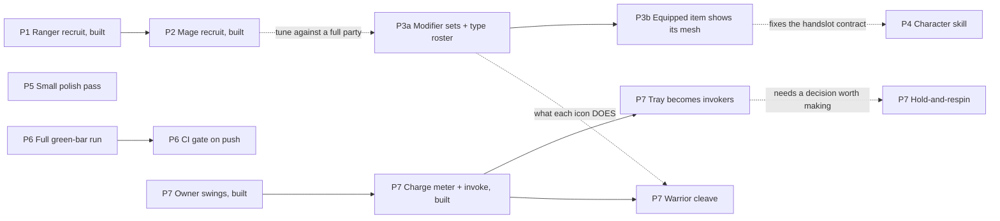

# Sir Fish — Backlog

> **Status: prioritised 2026-09-13, nothing scheduled; P5 added 2026-09-14; P6 added
> 2026-09-19; P1 and P2 audited and balance-checked, P7 opened 2026-09-20.** Seven
> ideas plus one spike, ranked. Each section records what already exists (checked against
> the code), what is missing, and what is decided or still open; where a section describes
> a design that was later replaced, it says so and gives what ships. The P3 and P4
> decisions were settled in review on 2026-09-13, and spike S1 was run the same day
> (§4). P5 is an unscoped list of small polish items.
>
> **P1 and P2 are built and tested, and their design calls are settled.** P2 was built the
> same day as P1 (2026-09-14) and went unrecorded here until the 2026-09-20 audit, which
> also found and fixed two P1 regressions that P2's commit had introduced (§1 "Found and
> fixed"). The balance question P1 left open is now measured: `test_level_curves` models
> warrior + recruits, and recruits make the early game easier without leaving the solo
> bands (§1 "Balance check"). Decided the same day: the mage quest is gated at level 5,
> recruits join at their quest's level (ranger 3, mage 5), enemies do **not** scale with
> party size, and the warbow is left alone pending a future slot-icon effort.
>
> **A slot-first pivot landed 2026-09-20 (§7), and it is now the active work.** The slot is
> the main character mechanically and the party emotionally: slot damage splits by icon owner
> so each hero swings for their own gear (`66298b9`), and hero specials - finished content
> that nothing could reach - became invokable off a charge meter (`e7f8298`). Both are
> headless-tested only, never yet seen in a running game. Decided but unbuilt: the upgrade
> tray becomes three special invokers, the warrior trades Defend for cleave, and the three
> slot upgrades move to town. §8 collects every decision with its status.

---

## 0. Priority at a glance

| # | Idea | Player value | Effort | Blocked by | Why this position |
|---|---|---|---|---|---|
| **P1** | ~~Ranger recruitment quest, offered from level 3~~ | High | M | nothing | **Built 2026-09-14; regressions fixed, balance measured, join level set 2026-09-20.** Unlock gate, one-shot tracking, relic-based `CollectObjective`, `RecruitRewardExtra` (joins at level 3), the quest and its warbow relic, all tested. The live playtest caught and fixed a real combat-loop bug (§1) |
| **P2** | ~~Mage recruitment quest, offered from level 5~~ | High | S | nothing | **Built 2026-09-14, the same day as P1; recorded here 2026-09-20, gated at level 5 the same day.** Deviated from the plan: one authored RELIC (the heartstone, a trinket) via `QuestDef.guaranteed_boss_drop`, not a staff. Its own `_load_authored_quests()` rewrite is what caused P1's regressions |
| **S1** | ~~Spike: does KayKit's `Rig_Medium` match the shipped rig?~~ | — | XS | — | **Done 2026-09-13: it matches** (§4) |
| **P3** | Modifier sets per item type; item types for every shipped hand mesh | Medium | M data + M visible props | 3.7 / 3.8, and P7 for what an icon does | P1–P2 unblocked it (a full party can be tuned now, §1's balance check). What blocks it is design: the new slot-icon ids are named but nobody has said what they DO (3.7), and the item-modifier rework may replace decision 3.1 entirely (3.8, §7) |
| **P4** | Prompt → Meshy → Blender → glb character skill | Medium | M | nothing: the trial character proved the route (§4) | What remains is packaging `rig_bandit_officer.py` as a skill and building 4.3's shared clip source |
| **P5** | Small polish pass: post-expedition summary, chest presentation, slot upgrade UI, party modal info, shadow monster rework | Low–Medium | S (each item) | nothing | Queued during a later session; not yet scoped against P1–P4 |
| **P6** | Make the headless suite a real gate: one full green-bar run, then CI on push | — (dev) | S | nothing | The first full green bar is recorded (2026-09-20: 31 suites, 0 failing - §6.1). What remains is CI: nothing runs the suites automatically. `tools/run_tests.py` (2026-09-19) exits non-zero on failure precisely so it can gate |
| **P7** | Slot-first combat: owner swings, invokable specials, player decisions in a fight | High | M | nothing | **Pivot decided and two pieces built 2026-09-20 (§7).** Damage splits by icon owner (`66298b9`) and specials are invokable off a charge meter (`e7f8298`). Remaining: the tray rewire, the warrior's cleave, moving the upgrades to town. Hold-and-respin is deferred behind the specials |

Solid arrows are hard dependencies. Dashed arrows are "better after".

---

## 1. P1 — Ranger recruitment quest (offered from level 3)

### The idea

Once the party reaches level 3, the mayor's board offers a one-off quest to retrieve a
specific item. Bringing it home adds the ranger to the party.

**Direction (2026-09-20).** The party starts as a lone warrior, and the ranger and mage
recruitment quests are meant to be part of the tutorial. Recruits are meant to make the
early game *easier*. That is now a checked target rather than an intention:
`test_level_curves` asserts it (§1 "Balance check").

This is the parked `content-phase-1/Sir Fish - Recruitment Quest Acceptance Test
Outline.md` plus a level gate. Read the outline first. This section only covers what
has changed since it was written and what the build needs.

### Already in place (before P1 was built)

- **The ranger is complete as data.** `resources/classes/ranger.tres` (executes `RAIN` and
  `BOMB_ARROW`; item types `bow`, `dagger`, `helm`, `ring`), `resources/stats/ranger.tres`,
  `ranger_rig.tres`, both abilities, and `scenes/battle/heroes/ranger.tscn` on the
  KayKit `rogue.glb`.
- **The party is multi-hero safe** (Content Phase 0 Step 5). `new_profile()` starts
  `active_party` as the warrior alone on purpose, and its comment says the others join
  "through a future recruit mechanic".
- **`QuestRewardExtra` existed** with `grant()`, `describe()` and a save registry, and
  had zero subclasses (it has one now: `RecruitRewardExtra`).
- **`QuestObjective` existed** with two kinds, `ClearEncountersObjective` and
  `SlayObjective` (it has three now, with `CollectObjective`).
- **`GameState.hero_level()` with no argument returns the party's best level**, which
  is the right reading of "the player reaches level 3".

### What has changed in the outline

- **§5.8's blocker is cleared.** Phase 1 Step 2b moved item eligibility onto
  `ClassDef.item_types`, so a recruit can wear armor and trinkets.
- **§5.7 is half stale.** Since the day/night cycle was scrapped the inn charges a flat
  `INN_NIGHT_COST`. Only `meal_cost()` still multiplies by party size, and
  `test_economy.gd` has no party-size references left.
- **§6 criterion 8 ("no code was edited") cannot hold for the first recruit.** The
  machinery below is code. It should hold for the *second* recruit, which is what
  makes P2 the real test.

### What was built (2026-09-14)

P1 landed in one pass in a first form, then the same evening's P2 commit (`7bfae68`)
rewrote its two shared classes into the relic design below. What follows is what ships;
decision 1.1 records what the first form did. Verified by the headless suites
(`test_quest_flow`, `test_quest_objectives`, `test_quest_gen`, `test_quest_generator`,
`test_profile_save`, `test_recruit_ranger`, `test_recruit_mage`, and the rest, all green -
§6.1) and a live playtest.

1. **The unlock gate.** `QuestDef.unlock_level` (default 1, so every existing quest is
   unaffected) and `QuestDef.one_shot` (default false). `mayor_office.gd`'s
   `_load_authored_quests()` skips a quest below `GameState.hero_level()`, and skips a
   `one_shot` quest whose id is already in `completed_quest_ids` - both filters drop the
   quest from the list entirely, distinct from `level_range`'s underlevelled *tint*,
   which still lets an available quest through early.
2. **`GameState.completed_quest_ids`**, profile-scoped, cleared by `new_profile()`.
   Persisted **additively** rather than with the `SaveGame.VERSION` bump this section
   originally called for - it's a new key with a sensible empty-array default on an
   old save, the same shape `hero_levels`/`quest_board`/`forge_stock` already use, so
   `save_game.gd`'s own version policy ("bump on a meaning change, never merely to add
   a key") says no bump is needed. `RunController._run_complete()` appends the quest's
   id on victory, alongside gold and the reward extras, guarded idempotent.
3. **`RecruitRewardExtra`** (`scripts/data/reward_extras/recruit_reward_extra.gd`), the
   first concrete `QuestRewardExtra`. Exports `hero_class`, `token_weapon_type` and
   `join_level`. `grant()` appends `hero_class` to `active_party` only if absent
   (idempotent); sets the recruit's level to `join_level` (never lowering a level she
   already has) with no xp toward the next; then equips the first unequipped inventory
   item whose `weapon_type` matches `token_weapon_type` onto the recruit - or leaves her
   empty-handed if there is none. It generates nothing. `describe()` reads "Ranger joins
   the party". Registered in `QuestRewardExtra.from_dict()`; the base class also gained
   the `_to_dict_extra()`/`_from_dict_extra()` hook pattern its own header already
   promised, mirroring `QuestObjective`'s. `join_level` is 3 for the ranger and 5 for
   the mage, each equal to its quest's `unlock_level` (both tests assert that), and an
   old save with no `join_level` loads as 1.
4. **The starting kit is the relic and nothing else** (decision 1.2).
5. **`CollectObjective`** (`scripts/data/objectives/collect_objective.gd`), registered
   in `QuestObjective.from_dict()`. Exports `target_weapon_type` and `count`; completes
   when that many `item_added` events carry an item of that type. See decision 1.1.
6. **The relic and its guaranteed drop.** `QuestDef.guaranteed_boss_drop`, a real
   `Item.Kind.RELIC` that bypasses `_roll_drop()`'s RNG on the quest's boss, and a
   `discard_expedition_loot()` exemption by kind so a wipe cannot delete it. Each recruit
   quest names its relic three times, and all three must agree (`test_recruit_ranger`,
   `test_recruit_mage` check it): the objective's `target_weapon_type`, the extra's
   `token_weapon_type`, and the drop's own `weapon_type`.
7. **The balance check** that was open here is done - see "Balance check" below.

The ranger recruitment quest itself is authored at `resources/quests/ranger_recruit.tres`
("The Ranger's Bow", `unlock_level = 3`, `one_shot = true`, boss `bandit_officer`, a
guaranteed boss drop of `resources/items/ranger_warbow.tres`, reward
`recruit_ranger.tres`). Its `level_range` is 3-5.

**Live-played, and it surfaced a real bug - not in P1's own code, but in the combat
loop P1 was the first thing to ever actually exercise with two heroes.** Reported as
"the ranger joins but the slot has no icons for her, so she never does anything in
combat." Traced to `slot_machine.gd`/`battle_director.gd`: heroes have never acted on
their own cooldown (`request_turn()` flatly returns for a hero) - the *only* hero who
ever gets a personal attack animation is whoever `_executor_for(Kind.DAMAGE)` picks
for the pooled `_hero_swing()`, which today is always the warrior. `DAMAGE_ALL`
(Chain) icons resolved as an impersonal lightning bolt ("source is null on purpose")
and `HEAL` icons healed the lowest-HP hero with no caster animation - so no class
other than the DAMAGE executor has ever had a visible action in combat. Invisible with
a solo warrior; guaranteed to surface the moment a second hero exists, exactly as the
recruitment outline's own §2 predicted ("grows `active_party` from one to two, the
single event most of the current code was never exercised against").

**Fixed 2026-09-14.** `Combatant.slot_gesture()` is a new, purely cosmetic swing
(bypasses `begin_action()`/`Ability` entirely, so it can never double-deal damage) that
plays the hero's own `attack` clip without resolving anything itself.
`SlotMachine._resolve_icon()` now calls it on `_executor_for(kind, false)` - a new
`fallback` param so this NEVER lands on the generic first-living-hero fallback, only a
class that actually owns the kind, which keeps it from ever colliding with a real
`_hero_swing()` on the same hero. Verified live: forced the board to a `slot_bolt`
(Chain) icon mid-combat with the real ranger recruit in the party and confirmed she
plays her real `attack` animation instead of standing idle. All of `test_executor`,
`test_slot_odds`, `test_ability_resolve` and `test_animation_clips` still pass. (Icons
phase 2 has since replaced `DAMAGE_ALL` and `slot_bolt` with `BOMB_ARROW`, `THUNDERBURST`
and `RAIN`; `slot_gesture()` is generic over `_executor_for(kind, false)` and was
unaffected.)

**Known, and left alone (decided 2026-09-20): the ranger never animates on the kit she
ships with.** `slot_gesture()` fires only when an icon of a kind her class executes
lands, and the ranger executes `BOMB_ARROW` and `RAIN`. The warbow has no modifiers and
she has no ring, so nothing she wears ever puts either in the bag until a drop does. What
the warbow *does* add is two `DAMAGE` icons: her innate icon, equal to the equipped
weapon's Power (45), and the warbow's base strike (also 45). Every `DAMAGE` icon resolves
as the party's one summed swing, by the first living hero whose class executes `DAMAGE`,
and that is the warrior. So a fresh ranger supplies most of the party's damage
(see "Balance check") while the screen shows the warrior swinging for it and her standing
idle. The mage is better off: her innate icon is a `HEAL`, so she animates whenever mend
lands, though her heartstone's base strike is likewise swung by the warrior.

The warbow stays as it is. A future effort is planned around slot icons generally, and
the fix belongs there (who animates for which icon) rather than in a one-off modifier
forced onto one relic. The obvious cheap fix - a forced `bomb_arrow` on the warbow - is
recorded here only so it is not rediscovered; it would also change the ranger's damage
(a `BOMB_ARROW` hits every enemy), so it would need the balance check re-run. Decision 1.7.

### Decisions (built 2026-09-14)

**1.1 Is the retrieved item a real `Item` during the run?** *Decided: no* - superseded,
see "Found and fixed" below. Originally: tracked as objective progress, `CollectObjective`
completing when the quest's boss encounter resolves (the same `encounter_resolved` event
`ClearEncountersObjective` reads, filtered to `def.is_boss`), with `RecruitRewardExtra.
grant()` creating the real item only at victory - avoiding two hazards the outline found:
`Item.slot()`'s unknown-type fallback (§5.1) and `discard_expedition_loot()`'s wipe sweep
(§5.2). **What actually ships (as of the P2 commit, 2026-09-14): the opposite answer.**
The item IS a real mid-run `Item`, of a new `Item.Kind.RELIC`, guaranteed to drop from the
quest's boss (`QuestDef.guaranteed_boss_drop`, bypassing `_roll_drop()`'s RNG entirely);
`CollectObjective` completes on the `item_added` event once the relic's own
`target_weapon_type` is seen, not on `encounter_resolved`. Both original hazards are
avoided a different way instead: the relic's `weapon_type` gets its own real
`Itemizer.ITEM_TYPES` row (so `Item.slot()` never falls through to the unknown-type
default), and `Kind.RELIC` is exempted from `discard_expedition_loot()`'s wipe sweep by
kind, not by tracking the token as non-existent. This is a strictly more robust design
(the objective tracker now shows real progress, and the token itself survives a wipe
rather than never having existed) - see "Found and fixed" for why the ranger's own
resources didn't carry it until 2026-09-20.

**Not built**: a distinct "pickup beat" VFX at the moment of retrieval, or a dedicated
line on the result screen calling the item out by name - `RecruitRewardExtra.describe()`
covers the reward row generically ("Ranger joins the party"). Worth a P5-style polish
pass, not a blocker.

Failing the quest before the boss falls just loses the progress - `start_expedition()`
always duplicates a fresh, zeroed `CollectObjective`, and the boss is always the last
encounter, so a wipe can only happen before the relic ever drops. A wipe can no longer
happen after it drops: `guaranteed_boss_drop`'s `item_added` completes the objective
immediately, which ends the run in victory before any further encounter could wipe the
party - the retrieved-item design closed off the case the original sentence here was
hedging against.

**1.2 What does the recruit start with?** *Recommend: the retrieved item is the
recruit's weapon.* The quest is to recover the ranger's lost bow, and the ranger
arrives with it equipped, plus a Common armor piece the way `new_profile()` equips the
warrior. That answers both the outline's §5.4 (is the token consumed?) and the
unarmed-recruit problem. **What actually ships: no armor piece.** `RecruitRewardExtra`
only ever searches inventory for an existing item matching `token_weapon_type` and
equips it if found (silently joining bare-handed if not) - there is no dynamic
generation of a Magic weapon or Common armor at grant time. The armor half of this
decision was never built for either recruit. The relic also keeps its own authored
`level` (warbow 9, heartstone 7) whatever the party's level, carries no modifiers, and the
ranger arrives with no armor and no trinket.

**1.3 What level does the recruit join at?** *Decided and built 2026-09-20: at their
quest's level - ranger 3, mage 5.* Not level 1, which is what shipped until then
(`RecruitRewardExtra.grant()` never set a level, so `hero_level()` defaulted a missing
entry to 1 and, because every member receives the full `expedition_xp`, a recruit trailed
by the same XP for good), and not the party's best level, which was the original
recommendation. A quest's level is the level the tutorial expects the player to be at,
so a recruit arrives at the level of the content that recruited them whatever the
warrior has reached since; if the warrior has out-levelled the quest the recruit is
simply behind, which is the point of a recruit. The level lives in
`RecruitRewardExtra.join_level`, one authored number per quest. The balance check below
prices the difference from level 1: none in damage (the relic drives it), but 20% more
party HP at level 3 (284 -> 340).

**1.4 When does the recruit join?** The outline's §5.3 recommendation stands.
`grant()` already runs only on victory, and `_reset_hero_runtime()` rebuilds the party
from `active_party` at the next `start_expedition()`. So the recruit is in the party
when the player gets back to town, with no live-combat spawning needed.

### Balance check (2026-09-20)

The question this section left open, "a second hero is a straight power jump the sim
harness doesn't model yet", is now measured. `tests/test_level_curves.gd` gained a party
model (`_case_recruit_ease`, `_case_full_party_bands`); the existing solo cases are
untouched and print byte-identical output. The party's icons all go into **one shared
bag** drawn onto **one 3x3 board**, as `SlotMachine._rebuild_bag()` does, so a hero
added dilutes the others' icons as well as adding its own. The file's header lists
what the model credits (single-target swing, `BOMB_ARROW`/`THUNDERBURST` against every
enemy, `RAIN`/`CLEAVE` spreading the swing, heal as regen) and what it leaves out (crit,
bleed ticks, payline doubles, `BLOCK`'s temporary armor, the trinket ultimates' 25% drop,
a hero dying mid-fight). Recruits enter at `RecruitRewardExtra.join_level`, read from the
authored resources, so the harness follows the data.

Figures are one seeded run (seed 20260910, 8,000 sampled boards per party), enemies at
the warrior's level, a group of two. "ttk" is seconds to kill a regular enemy with
everything on it, then to clear the group; "ttd" is seconds for the group to kill the
whole party (heal regen not subtracted). **Read the direction and the size of the gaps,
not the decimals**: the warrior's Magic gear is randomly rolled from the same seeded
stream, so an absolute figure moves when cases are reordered (the level-5 solo row went
from 5.2 / 10.4 to 6.6 / 8.6 that way) even though nothing in the game changed.

| Party | ttk | ttd | party hp |
|---|---|---|---|
| **warrior L3**: solo | 7.2 / 14.3 | 13.9 | 204 |
| + ranger, just joined (L3) | 3.9 / 7.8 | 20.4 | 340 |
| **warrior L5**: solo | 6.6 / 8.6 | 14.4 | 288 |
| + ranger, just joined (L3) | 4.5 / 6.1 | 18.2 | 424 |
| + ranger levelled with the party (L5) | 4.5 / 6.1 | 20.6 | 480 |
| + ranger (L5) + mage, just joined (L5) | 4.3 / 6.0 | 26.6 | 650 |

| Full geared party (all three at the band's rarity) | ttk | ttd |
|---|---|---|
| band 10: solo warrior -> warrior + ranger + mage | 6.7 / 8.7 -> 4.8 / 6.0 | 14.9 -> 33.8 |
| band 20 | 6.7 / 9.3 -> 4.4 / 5.9 | 15.3 -> 34.6 |
| band 30 | 5.5 / 6.8 -> 4.0 / 4.8 | 15.4 -> 34.9 |

What it says:

1. **Recruits make the early game easier, as intended.** At level 3 the ranger nearly
   halves the time to clear a group (14.3s to 7.8s) and lengthens the party's life by
   about half (13.9s to 20.4s). At level 5 she still cuts the clear time by about 30%.
   Each recruit shortening the fight and lengthening the party's life is asserted.
2. **Easier, not trivial.** A recruited party kills a regular enemy in 3.9-4.5s, and a
   full geared party in 4.0-4.8s at bands 10-30: all inside the solo bands' own 3-9s
   window. That is asserted too; the 3s floor is borrowed from the solo bands, not a
   fresh design number.
3. **Almost all of the damage is the ranger, and almost all of the ranger is her relic.**
   The warbow's Power is 45 (level 9 x 5), and it counts twice: as her innate icon and as
   the warbow's own base strike, each worth 52 on the board against the level-3
   warrior's 18-Power sword. The mage is worth HP and healing, not damage: on top of the
   level-5 ranger she moves the group clear time by 0.1s, but lengthens the party's life
   from 20.6s to 26.6s and roughly triples regen (1.6 to 4.8 HP/s).
4. **Joining at the quest's level instead of level 1 changes HP only** (party HP 284 ->
   340 at level 3; ttd 17.0s -> 20.4s). The recruit's damage comes from the relic, not
   from her level, so the ttk rows do not move.
5. **The late game is far sturdier with a full party, and that is accepted.** A full
   geared party stays inside the ttk window but **outlasts the solo warrior about 2.3x at
   every late band** (~34s against ~15s), because the enemy group is two whatever the
   party size. Decided 2026-09-20: enemies will **not** scale with party size, so this
   is the intended shape rather than a gap (decision 1.6). The harness asserts only that
   the full party stays inside the ttk window and outlasts the solo warrior.

### Found and fixed (2026-09-20)

This audit set out to start P2, and found it already built (§2) - which meant checking
whether it actually still agreed with what P1 shipped six days earlier. It didn't, in
two ways, both traced to the mage commit (`7bfae68`) rewriting the same shared files
P1 had just built, apparently developed in parallel without P1's changes and never
reconciled against them:

1. **The unlock gate silently disappeared.** `bc9b70d` (P1) added the `unlock_level`/
   `one_shot`/`completed_quest_ids` checks to `mayor_office.gd::_load_authored_quests()`
   described in point 1 above. `7bfae68` (P2), the same evening, rewrote that same
   function to add `_already_recruited()` - but its version of the function was a plain
   `if res is QuestDef: out.append(res)`, with no unlock_level/one_shot logic at all,
   silently dropping both checks. The ranger recruitment quest has been offerable from
   level 1, not level 3, ever since, and any future `one_shot` quest that isn't also a
   recruit would never retire. Caught because `tests/test_quest_generator.gd`'s
   `_check_authored_quest_order` - written the same evening, correctly assuming the gate
   was still there, and simply never run until this audit (it's one of the eight suites
   `tools/run_tests.py` turned up as never having a recorded pass; see P6 §6.1) - asserts
   exactly the 4-quest, gate-respecting list this regression breaks. **Fixed**: restored
   the two checks alongside `_already_recruited()`, which stays (it's still what retires
   `recruit_mage.tres`, which was ungated at the time and is now gated at level 5 but still ships without `one_shot` - see §2).
2. **The ranger's own resources were never migrated to the relic design.** `7bfae68`
   also rewrote `collect_objective.gd` and `recruit_reward_extra.gd` wholesale for the
   mage's new design (decision 1.1's "what actually ships", above) - a real behavior
   change to a shared base class, landed without updating `ranger_recruit.tres`'s own
   `collect_ranger_bow.tres` (no `target_weapon_type`, so its `CollectObjective` could
   never legitimately complete - `is_complete()` needs an `item_added` matching a type
   that was never set) or `ranger_recruit.tres` itself (no `guaranteed_boss_drop`, so
   there was nothing authored for it to match against). The quest still worked in
   practice only because `_next_encounter()` has a second, independent path to
   `_run_complete()` when the encounter list runs out (the boss is always last) -
   the objective tracker just permanently read 0/1, and `RecruitRewardExtra` had no
   guaranteed item to find, so the ranger recruit's `token_weapon_type = &"bow"` could
   only ever equip an ordinary bow that happened to be sitting unequipped in inventory,
   joining bare-handed otherwise. **Fixed**: added `&"warbow"` to `Itemizer.ITEM_TYPES`'s
   authored-relics block (mirroring `heartstone`, but `Slot.WEAPON` - the ranger's own
   quest is specifically about recovering her bow), authored
   `resources/items/ranger_warbow.tres` (RELIC, level 9 - two above the quest's own
   band ceiling, mirroring `mage_heartstone.tres`'s level 7 against its band's ceiling
   of 5), set `target_weapon_type`/`guaranteed_boss_drop` on the ranger's own two
   resources, and updated `recruit_ranger.tres`'s `token_weapon_type` to match. Added
   `tests/test_recruit_ranger.gd`, mirroring `test_recruit_mage.gd`'s coverage, since
   nothing had exercised the ranger's own resource wiring before - the gap that let
   this drift six days without being caught.

---

## 2. P2 — Mage recruitment quest (offered from level 5)

**Built 2026-09-14, the same day as P1, one commit later (`7bfae68`) - complete with its
own dedicated test (`tests/test_recruit_mage.gd`) and a live-tested pacing fix (see
below). None of this was recorded here until the 2026-09-20 audit, which is also what
found the two P1 regressions this same commit introduced (§1 "Found and fixed").**

*Original plan, below, superseded by what actually shipped:*

- ~~**Should be resources only**: one `QuestDef` with `unlock_level = 5`, `one_shot`, a
  `CollectObjective`, and a `RecruitRewardExtra` whose `class_id` is `mage`. If any code
  has to change, P1's machinery was not generic enough; fix it there. This is the
  outline's criterion 8.~~ **Code did change** - `collect_objective.gd` and
  `recruit_reward_extra.gd` were rewritten for a new, more robust design (decision 1.1),
  not because P1's machinery was too narrow but because this one is a real improvement:
  a real, RELIC-kind mid-run item with a guaranteed boss drop, rather than P1's abstract
  "boss encounter resolved" progress tracking. `RecruitRewardExtra`'s fields are
  `hero_class`/`token_weapon_type`, not `class_id`.
- ~~**The retrieved item is the mage's staff.**~~ **It's the mage's TRINKET instead** -
  `resources/items/mage_heartstone.tres`, an authored `heartstone` RELIC resolving to
  `Item.Slot.TRINKET` (`Itemizer.ITEM_TYPES`'s own comment: "never rolled by any
  generator... no ClassDef lists these in item_types"). Decision 3.4 (shields to the
  warrior, tome to the mage) hadn't landed and still hasn't (§3 is still open) - this
  sidesteps it rather than depending on it.
- ~~**`unlock_level = 5`.**~~ **Set 2026-09-20** (it shipped ungated on 2026-09-14, offered
  from level 1, so the mage could join before the ranger). `recruit_mage.tres` now has
  `unlock_level = 5` and `RecruitRewardExtra.join_level = 5`. It still ships without
  `one_shot`: retirement is via `_already_recruited()` alone (§1 "Found and fixed"
  point 1), which drops the quest from the board once the mage is in `active_party`.
  `test_quest_generator` pins the board at levels 1, 3, 4 and 5.
- **Three heroes is a bigger step than two - covered on both axes.** *Animation:* P1's
  `slot_gesture()` fix (§1, "Fixed 2026-09-14") is generic over `_executor_for(kind,
  false)`, so the mage's `HEAL` icon already animates her. *Balance:* `test_level_curves`
  now models warrior + ranger + mage (§1 "Balance check"). The mage adds almost no
  damage (group clear 6.1s -> 6.0s at level 5) but a lot of survivability (party life
  20.6s -> 26.6s, regen 1.6 -> 4.8 HP/s); nearly all of the recruits' early-game lift is
  the ranger's warbow. `meal_cost()` still triples with three heroes
  (`MEAL_COST_PER_HERO * party size`).
- ~~**Pacing (rough estimate, not measured).**~~ **Superseded by a live-testing result.**
  The commit message: "Pacing mirrors easy.tres (5 encounters, level 1-5, a shop stop
  before the boss) after an early higher-level/shorter draft wiped a solo starting
  warrior in live testing." The quest first shipped at `level_range = Vector2i(1, 5)`, a
  band chosen for a level-1 party. **Re-banded 2026-09-20 to 5-7** to match its level-5
  gate (a gated quest is only ever seen by a party of level 5 or more), and the ranger's
  from 3-7 to **3-5** the same day. The mage's is the harder band of the two; both are
  playtest-unverified. With them no two authored quests share a `level_range.x` (1, 3, 5,
  6 and 15), so `test_quest_generator` asserts the exact board order at level 5:
  easy, ranger, mage, medium, hard. Decision 2.2.

---

## 3. P3 — Modifier sets per item type, and item types for every shipped mesh

### Where it stands today

**Eleven rollable item types**, defined in `Itemizer.ITEM_TYPES` and owned through
`ClassDef.item_types`:

| Class | Weapon | Armor | Trinket |
|---|---|---|---|
| Warrior | axe, sword | mail | idol |
| Ranger | bow, dagger | helm | ring |
| Mage | staff | shield | amulet |

`ITEM_TYPES` has two more rows, the authored relics `heartstone` (trinket) and `warbow`
(weapon). They are the mage's and ranger's recruitment prizes (§1, §2). No class lists
them, so no generator can roll them, and they sit outside the tables below.

**Modifiers are pooled by slot and type, and the pools are small.** Each entry in
`Itemizer.MODIFIERS` names the slots allowed to roll it and, for most, the specific
`types` (`_modifiers_for_type()` applies both). Rarity sets how many an item carries:
Common 0, Magic 1, Rare 2, Enhanced 3 (`RARITY_MOD_COUNT`). The pools:

| Types | Pool | Size |
|---|---|---|
| axe, sword | `elem_fire`, `elem_ice`, `elem_light`, `bleed` | 4 |
| bow, dagger | `bomb_arrow` | 1 |
| staff | `lightning_blast` | 1 |
| helm, mail, shield | `armor_block`, `slot_mend` | 2 |
| idol, ring, amulet | `crit`, plus `cleave`, `rain` or `thunderburst` respectively | 2 |

As a result:
- **Only the warrior's weapons can deal three distinct modifiers.** Every other pool is
  smaller than the three picks a full forge ladder needs, so `_modifier_pool_excluding()`
  falls back to repeating one: a Rare bow carries two `bomb_arrow` icons, and armor and
  trinkets repeat at Enhanced. (The comment on `forge()`'s `pool.is_empty()` guard, "7
  modifiers, 4 slots", predates this and is wrong.)
- **Class carries modifier identity already, type within a class does not.** Warriors roll
  elements and bleed, rangers `bomb_arrow`; but an axe and a sword, a bow and a dagger,
  and the three armors roll identical pools.
- **Enhanced's third icon is locked at the top of its range**
  (`FORGE_ICON_POWER_MAX`, 175% of Power) and carries the `enhanced` marker the UI
  tints.

**Equipping an item never changes the model.** Prop meshes are hidden per character,
statically, through `RigProfile.hidden_parts`:
- The ranger shows `1H_Crossbow`.
- The mage shows `2H_Staff` and a closed `Spellbook`.
- The warrior shows every prop at once. `warrior_rig.tres` has no `hidden_parts`, and
  neither the scene nor the import settings hide anything. A Godot screenshot on
  2026-09-13 confirmed it: the knight renders its shields and swords together.

**Types and meshes do not line up.**
- `axe` has no mesh.
- `bow` is drawn as the rogue's crossbow.
- `shield` belongs to the mage, although all four shield meshes ship on the knight.

**The KayKit Adventurers 2.0 pack fills these gaps.** It was downloaded on 2026-09-13 to
`C:\Projects\Third Party Assets\KayKit\KayKit_Adventurers_2.0_FREE\` (CC0). Its
`Assets/gltf/` props include:
- axes: `axe_1handed`, `axe_2handed`;
- bows and crossbows: `bow`, `bow_withString`, `crossbow_1handed`, `crossbow_2handed`;
- blades: `dagger`, `sword_1handed`, `sword_2handed`;
- five shields: `badge`, `round`, `round_barbarian`, `spikes`, `square` (most with
  `_color` variants);
- casting props: `staff`, `wand`, `spellbook_closed`, `spellbook_open`;
- extras: `quiver`, `smokebomb`, arrows.

Its characters are on `Rig_Medium`, which S1 found identical to ours, so the props
should sit on the same `handslot` bones. That part is untested.

### Decided (review, 2026-09-13)

1. **The modifier rule.**
   - Every item type has a fixed set of **exactly four** modifiers.
   - Rarity deals from that set in a random order and never repeats: Magic gets 1,
     Rare 2, Enhanced 3. Common stays at 0. Forging continues dealing from whatever is
     left.
   - When an item reaches Enhanced, after its third modifier is added, **one of its
     three modifiers is chosen at random and boosted by 1.5×**.
   - The fourth modifier in a set is simply the one that particular item never drew.
2. **Visible gear starts with hand items only.** Head and chest props stay part of the
   character.
3. **`Rectangle_Shield` is the tower shield.**
4. **Shields move to the warrior, and the mage's armor becomes the tome** (the
   `Spellbook` mesh). This reverses the content-phase-1 questions doc's Q3.

### Item types after these decisions

| Class | Weapon | Armor | Trinket |
|---|---|---|---|
| Warrior | sword, greatsword *(new)*; axe open (3.6) | mail, round shield, kite shield, tower shield, spiked shield | idol |
| Ranger | dagger, crossbow *(replaces bow; 3.6)*, heavy crossbow *(new)* | helm | ring |
| Mage | staff, wand *(new)* | tome | amulet |

That is 17 types, 12 of them with a visible mesh (18 if `axe` is kept).

| Mesh | Ships on | Attaches to | Type | Slot | Class | Status |
|---|---|---|---|---|---|---|
| `1H_Sword` | knight | `handslot.r` | sword | Weapon | warrior | draft |
| `2H_Sword` | knight | `handslot.r` | greatsword | Weapon, two-handed | warrior | draft |
| `Round_Shield` | knight | `handslot.l` | round shield | Armor | warrior | decided |
| `Badge_Shield` | knight | `handslot.l` | kite shield | Armor | warrior | decided |
| `Rectangle_Shield` | knight | `handslot.l` | tower shield | Armor | warrior | decided |
| `Spike_Shield` | knight | `handslot.l` | spiked shield | Armor | warrior | decided |
| `Knife` | rogue | `handslot.r` | dagger | Weapon | ranger | draft |
| `1H_Crossbow` | rogue | `handslot.r` | crossbow | Weapon | ranger | draft |
| `2H_Crossbow` | rogue | `handslot.r` | heavy crossbow | Weapon, two-handed | ranger | draft |
| `1H_Wand` | mage | `handslot.r` | wand | Weapon | mage | draft |
| `2H_Staff` | mage | `handslot.r` | staff | Weapon | mage | draft |
| `Spellbook` (and `Spellbook_open`, its casting pose) | mage | `handslot.l` | tome | Armor | mage | decided |
| `1H_Sword_Offhand`, `Knife_Offhand`, `Throwable` | knight, rogue | hands | — | — | — | open (3.5) |
| `Knight_Helmet`, `Mage_Hat`, all three capes | all three | `head`, `chest` | none; part of the character | — | — | decided |

All seven KayKit characters in `assets/meshes/` share one identical 41-bone rig (the
joint lists were compared directly), and props are unskinned meshes parented to the
`handslot` bones. **A prop from any KayKit character can go on any other** by
reparenting, with no re-rig.

Renaming a type id (`bow` → `crossbow`) changes the `weapon_type` stored in saves, so it
needs a `SaveGame` migration. Phase 0 made those routine. The alternative is to keep
the old id and change only the nouns and the mesh.

### Implementing the modifier rule

- **The data moves onto the type.** Each `ITEM_TYPES` row gains `modifiers: [four ids]`.
  Today the pool is *derived*: each `MODIFIERS` entry names the `slots` that may roll it
  and, for most, a `types` list, and `_modifiers_for_type()` filters on both. The explicit
  list replaces that derivation, so `MODIFIERS[].slots`/`types` and
  `_modifiers_for_type()` go. Generation and `forge()` both draw from the type's set,
  minus whatever the item already carries.
- **Enhanced changes meaning.** The third icon no longer locks to 175% of Power; it rolls
  normally, like every other icon (125–175%). After it is added, one of the three
  modifiers is picked at random: its `roll` is multiplied by 1.5 (rounded, and always at
  least +1), its label is re-rendered, and it takes the `enhanced` marker.
- **The repeat fallback becomes dead code.** Four ids against at most three picks means
  `_modifier_pool_excluding()` can never run dry, so its repeat-a-roll branch can be
  deleted. (It is live today: see "Where it stands".)
- **The ceiling rises.** The strongest possible damage-kind icon goes from 175% of Power to
  about 262% (1.75 × 1.5), and a boosted `slot_mend` from 9% to about 13%. Re-run
  `test_level_curves`, which now models a full party, and the forge economy checks.
- **Saved items are grandfathered.** Existing items may carry modifiers outside their
  type's new set, and existing Enhanced items still have the old locked icon.
  `Item.from_dict()` loads both verbatim, and the forge only deals ids the item does not
  carry, so no migration is needed unless a type id is renamed.
- **The sword's set must include `elem_fire`.** `new_profile()` forces the starter
  sword's one modifier to `elem_fire`, and `test_level_curves` mirrors that for its
  level-1 band. The sword's current pool already contains it.

### Rules for choosing each type's four

- **Pick kinds the item can scale.** `DAMAGE`, `BLEED`, `BOMB_ARROW`, `THUNDERBURST`,
  `CLEAVE` and `RAIN` icons roll 125–175% of `power()`, which is 0 on armor; on armor they
  fall back to the def's own flat `roll` range, which never grows with level. `BLOCK`
  scales off `armor_value()`, which is 0 on weapons and trinkets. `HEAL` (`slot_mend`)
  keeps its own percent roll, so it fits any slot.
- **Lean toward the kinds the owning class executes.** The warrior executes `DAMAGE`,
  `BLOCK`, `BLEED` and `CLEAVE`; the ranger `BOMB_ARROW` and `RAIN`; the mage `HEAL` and
  `THUNDERBURST`. An icon no living hero executes falls back to the first living hero,
  so misaligned gear still works but reads wrong. Note that every `DAMAGE` icon, whoever
  owns the item, resolves as the party's one summed swing by the first living hero whose
  class executes `DAMAGE`, which is always the warrior (§1, "Still open").

The modifiers that exist today, by kind (`SlotIcon.kind_of()`; `KNOWN_MODIFIER_IDS` lists
the rollable ones):

| Kind | Ids | Rolls from | Executor |
|---|---|---|---|
| `DAMAGE` | `elem_fire`, `elem_ice`, `elem_light` (warrior weapons); `lightning_blast` (staff); `crit` (any trinket) | Power | warrior |
| `BLEED` | `bleed` (warrior weapons) | Power | warrior |
| `BOMB_ARROW` | `bomb_arrow` (bow, dagger) | Power | ranger |
| `THUNDERBURST` | `thunderburst` (amulet) | Power | mage |
| `CLEAVE` | `cleave` (idol) | Power, though resolution only reads that it rolled | warrior |
| `RAIN` | `rain` (ring) | Power, likewise | ranger |
| `HEAL` | `slot_mend` (any armor) | its own percent roll | mage |
| `BLOCK` | `armor_block` (any armor) | armor | warrior |

**The gaps.** Four per type exposes how thin the roster is. Against the current pools:

| Types | Have | Short by |
|---|---|---|
| axe, sword | `elem_fire`, `elem_ice`, `elem_light`, `bleed` | 0 |
| bow | `bomb_arrow`; `bow_shoot` (named 2026-09-20, not built) | 2 |
| dagger | `bomb_arrow`; `dagger_stab`, `dagger_throw` (named) | 1 |
| crossbow, heavy crossbow (planned, 3.6) | none named | 4 |
| staff | `lightning_blast`; `staff_bolt` (named) | 2 |
| wand (planned) | `wand_bolt`, `wand_lightning` (named) | 2 |
| helm, mail, tome, and each shield | `armor_block`, `slot_mend`; per-shield ids to be named (3.7) | 2 |
| idol, ring, amulet | `crit` and one ultimate each | 2 |

- **Armor is the worst case:** every armor type rolls the identical two ids, so telling
  the four shields and the tome apart needs new armor modifiers, for example thorns on
  the spiked shield or a heavier block on the tower shield.
- **The ranger and mage own one weapon id each**, so their weapons lean on their own kind
  by a single modifier.
- **The warrior's weapons already have exactly four**, so `sword` and `greatsword` can
  differ only by how a new type's set is drawn from them.

Each new id needs:
- chip and glyph art (slot glyphs fall under the already-approved Meshy lift);
- a `SlotIcon.kind_of()` entry and a `KNOWN_MODIFIER_IDS` entry;
- if it introduces a new mechanic such as thorns, the mechanic itself.

Drafting all 17 sets is P3a's first task, after decision 3.7 says which new ids exist.

### The visible-props plan (P3b)

- Each `ITEM_TYPES` row gains `prop` (the mesh name) and `two_handed`.
- `CombatantRig.build()` shows the props for the equipped weapon and armor and hides
  every other hand prop, replacing `hidden_parts` for the hands. A prop from another
  character's glb is instanced onto the matching `handslot` bone.
- **An empty slot shows nothing in that hand.** Head and chest props are never
  affected.
- **A two-handed weapon hides the off-hand prop**, because a greatsword and a shield
  would clip. It has to be a per-type flag, not something read from the mesh name: the
  mage's `2H_Staff` next to a book is KayKit's own default look.
- **A weapon type may override the attack clip.** The shipped glbs already carry
  `2H_Melee_Attack_Slice`, `Dualwield_Melee_Attack_*` and `2H_Ranged_Shoot`, and the
  KayKit Character Animations pack adds real bow clips (`Ranged_Bow_Draw`,
  `Ranged_Bow_Release`, `Running_HoldingBow`). However,
  `tools/strip_unused_animations.gd` drops any clip missing from its `KEEP` table at
  import, and `tests/test_animation_clips.gd` fails if that table drifts. Every
  override clip therefore has to be added there.

### Still open

**3.5 The two off-hand weapons and `Throwable`:** *Decided 2026-09-20: ignore them for
now.* The focus is a few equipment meshes first; the off-hand weapons and `Throwable`
stay hidden and are not item types until that is done. (`Throwable` shares the weapon
hand, so it is probably an ability prop rather than an item when it comes back.)

**3.6 Axe and bow:** the meshes now exist in the Adventurers 2.0 pack (`axe_1handed`,
`axe_2handed`, `bow`, `bow_withString`), so this is a design question, not an art one.
*Recommend:*
- keep `axe` for the warrior;
- keep a true `bow` for the ranger, which the animation pack's `Ranged_Bow_*` clips
  support;
- add `crossbow` and `heavy crossbow` as further ranger types.

That adds two types to the table above and avoids renaming the `bow` id.

**3.7 New modifier ids: partly decided 2026-09-20.** This is the slot-icon work; naming
the ids closes the question of *which* ids exist, not yet of what they do.

- **Weapon ids, named:** bow `bow_shoot`; dagger `dagger_stab` and `dagger_throw`; staff
  `staff_bolt`; wand (a new type) `wand_bolt` and `wand_lightning`. None is built yet.
- **Shield ids, pending:** one per shield, to tell them apart. The available shields:

  | Mesh on `knight.glb` | Pack file (Adventurers 2.0) | Working name (decided, §3) |
  |---|---|---|
  | `Round_Shield` | `shield_round` | round shield |
  | `Badge_Shield` | `shield_badge` | kite shield |
  | `Rectangle_Shield` | `shield_square` | tower shield |
  | `Spike_Shield` | `shield_spikes` | spiked shield |
  | none on the knight | `shield_round_barbarian` | unnamed: a fifth shield the pack ships |

  The pack has `_color` variants of `round`, `badge`, `spikes` and `square` (not
  `round_barbarian`). The knight-to-pack pairing above is by name and unverified. The
  older `warrior.glb` also carries a shield (`W_ShieldFace`, `W_ShieldRim`), but as part
  of that model, not a prop.
- **Trinkets:** `crit` has no `types` restriction, so **all three trinket types can roll
  it** (idol, ring and amulet). Each also rolls its own class ultimate (`cleave`, `rain`,
  `thunderburst`), and that is the whole pool of two. The authored relics (`heartstone`,
  `warbow`) roll nothing.
- **Still undecided, and blocking the set drafts:** what each new id *does*: its `Kind`,
  what it scales off, and which class executes and animates it. See the gaps table for
  what is still short of four after these ids.

---

## 4. P4 — Prompt → Meshy → Blender → glb character skill

### The idea

A reusable skill: a text prompt goes in, and a rigged glb comes out that plays a
standard library of 100+ animations.

### Where it stands

The project has two character pipelines, and they do not share a skeleton.

| | In-house rig | Shipped KayKit rig |
|---|---|---|
| Bones | 17 (`Root`, `Hips`, … `Foot.R`) | 41: the 23 of `Rig_Medium`, plus 18 IK and control bones |
| Used by | the sporecap (`AUTHORED_SKELETON` profiles) | warrior, ranger, mage, and the four skeleton enemies |
| Animations | Built in GDScript: 4 shared builders plus 1 authored attack per enemy | Baked into each glb: 76 (Adventurers) or 95 (Skeletons) |
| Documented | CLAUDE.md, "Adding a new enemy" | Not written up as a pipeline |

**The shipped KayKit characters are the older 1.x export.** Their armature object is
named `Rig`, they were exported with Blender glTF I/O 1.7.33, and the clips are baked
in. S1 below shows the skeleton underneath is nonetheless `Rig_Medium`.

`design documents/character_generation_workflow.docx` is an early, generic draft of
this skill, and it contradicts what building the sporecap taught. The skill should
supersede it:

| The docx says | What the project learned (CLAUDE.md) |
|---|---|
| `meshy-6` | `smart-topology` (meshy-t2): half the price, returns separated parts |
| T-pose or A-pose | Depends on the rig; see decision 4.7 |
| Automatic weights (`ARMATURE_AUTO`) | Bone heat fails on these meshes; weight by region, by hand, or copy the mannequin's weights (4.8) |
| Keep Meshy's PBR textures | Flat palette materials |
| 50k–100k polygons | About 4k triangles |
| FBX | glb, with `export_apply=False` |

### The clip source: KayKit Character Animations (decided, downloaded)

The free v1.1 tier was downloaded and inspected on 2026-09-13: one 14.9 MB zip.
`License.txt` confirms CC0. It has not been added to the project.

- **`Rig_Medium`: 132 clips** in eight category files: CombatMelee 22, CombatRanged 20,
  General 15, MovementAdvanced 13, MovementBasic 11, Simulation 14, Special 15, Tools 29.
- **`Rig_Large`: 34 clips** in six files. That makes 166 in total; the product page's 161
  probably excludes poses such as `T-Pose` and one `EXPERIMENTAL_` clip.
- **Formats:** both glb and FBX.
- **A mannequin base is included**, although the product page does not mention it:
  `Mannequin_Medium` and `Mannequin_Large`, as glb and FBX, with one texture. This is
  the "standard base".
- **88 clips are new relative to the project's 95.** They include bow draw and release,
  magic summon, crawling, sneaking, crouching, waving, push-ups, the tool set, and seven
  fishing clips (`Fishing_Cast`, `Fishing_Bite`, `Fishing_Tug`, `Fishing_Reeling`,
  `Fishing_Struggling`, `Fishing_Catch`, `Fishing_Idle`) for a game called Sir Fish.

### S1 results — the rig check (done 2026-09-13)

**The shipped `Rig` is `Rig_Medium`.**

- All 21 deform bones match by name and by parent, and their rest poses are identical:
  0.000 difference in translation and 0.000° in rotation.
- Every bone the pack animates exists in our rig.
- There are only two differences:
  - The armature is named `Rig` in ours and `Rig_Medium` in the pack.
  - Our 1.x glbs carry 18 IK and control bones (`kneeIK.l`, `control-toe-roll.l`, …)
    that the pack dropped. The pack's clips simply leave them alone.
- **The standalone `Mannequin_Medium.glb` has only the 21 deform bones and no `handslot`
  bones.** The armature inside every `Rig_Medium_*` animation glb has 23 bones,
  handslots included, and carries the same mannequin mesh. A generated character should
  take its armature from an animation glb (or from `knight.glb`), not from the
  standalone mannequin.
- **The rest pose is a true T-pose.** Both upper arms are exactly horizontal, in the pack
  and in `knight.glb`.

**Clip names changed, and a few motions the game plays today changed with them.** Every
clip that `resources/rig_profiles/` references:

| Played today | Pack name | Motion |
|---|---|---|
| `Block` (warrior special) | `Melee_Block` | identical |
| `Hit_A` (everyone) | `Hit_A` | identical |
| `Death_A` (everyone) | `Death_A` | identical |
| `1H_Ranged_Shoot` (ranger) | `Ranged_1H_Shoot` | identical |
| `Spellcast_Shoot` (mage, skeleton mage) | `Ranged_Magic_Shoot` | identical |
| `Idle` (everyone) | `Idle_A` | revised: up to 27° apart, not a loop-phase offset |
| `Running_A` (everyone) | `Running_A` | a different run under the same name |
| `1H_Melee_Attack_Chop` (warrior attack) | `Melee_1H_Attack_Chop` | revised: up to 19° apart, same length |
| `Unarmed_Melee_Attack_Kick` (skeleton minion, skeleton rogue) | `Melee_Unarmed_Attack_Kick` | revised: up to 58° apart |
| `Unarmed_Melee_Attack_Punch_A` (skeleton warrior) | `Melee_Unarmed_Attack_Punch_A` | different, and shortened from 1.47 s to 1.17 s |

"Identical" means under 0.1° apart on every deform bone, sampled across the clip.

Across all 95 of the project's clips:
- **69 carry over unchanged.** 30 of them have new names, such as `1H_*` → `Melee_1H_*`
  or `Ranged_1H_*`, `Spellcast_*` → `Ranged_Magic_*`, `Cheer` → `Cheering`, and
  `Taunt` / `Death_C_*` → `Skeletons_*`. The other 39 keep their names.
- **26 changed or have no identical counterpart.** Examples: `Idle`, `Running_A`, the
  1H chops and slices, `2H_Ranged_*`, `Unarmed_*`, and poses like `Lie_Pose` and
  `Sit_Chair_Pose`.

**Proportions are more flexible than 4.1 first assumed.** The pack keys translation on
every bone, but most of those keys never move. Excluding the `Skeletons_*` clips, which
throw bones apart on purpose:

- `spine`, `chest`, `head`, and every bone below the elbow and knee **never leave their
  rest position**.
- `root` and `hips` carry the locomotion.
- `upperarm` and `upperleg` shift by up to about 0.18 units, in roughly 45 clips each
  (shoulder and hip shrugs).
- The `handslot` bones move by up to about 0.59 units in about 40 clips (a weapon
  dropping on death, a dig).

A character with different limb lengths can therefore discard the constant position
tracks and lose nothing. The only real losses are small shoulder and hip shrugs. Godot's
import-time retargeting can strip position tracks; this project has not tried it.

### Decisions

**4.1 Standard skeleton: `Rig_Medium`** (*decided, and confirmed by S1*).

- The shipped heroes and skeleton enemies are already on it. No upgrade to the v2
  character packs is required.
- It carries the `handslot` bones that P3b's props attach to.
- The in-house 17-bone rig stays for non-humanoid enemies like the sporecap.
- Generated characters take the 23-bone armature from a `Rig_Medium_*` animation glb.

**4.2 Clip source: KayKit Character Animations** (*decided; downloaded and verified*).
132 `Rig_Medium` clips.

**4.3 Bake clips into every glb, or share one library?** *Recommend sharing.* Each
shipped KayKit glb is already 3.6–4.9 MB with 76–95 clips baked in, and the web-delivery
work already strips unused clips at import because of that weight. S1 turned up three
concrete integration points:

- **A second clip source.** `CombatantBakedAnimations.build()` reads clips only from the
  `AnimationPlayer` inside the character's own glb. A shared library needs a second
  source, for example a library resource on `RigProfile`.
- **The root name.** The pack's tracks are rooted at the `Rig_Medium` armature, not
  `Rig`. `_retarget()` already re-roots every track path, so the armature name needs
  mapping there, or renaming when the pack is imported.
- **Stripping.** `strip_unused_animations.gd`'s `KEEP` table is keyed by glb file stem,
  so the eight pack files need entries, and `test_animation_clips.gd` pins that table.

**4.4 One project or every project?** *Recommend user-level*, beside
`new-godot-project` in `~/.claude/skills/`, with palette, rig source and output paths
passed in. The Meshy and Blender lessons are not specific to Sir Fish.

**4.5 Meshy spend** (*open*). Meshy is on hold until the design locks, with exceptions
only for slot board glyphs and biome frames. A trial character costs roughly 9 credits
for the concept image, plus 5 for a mesh-only smart-topology generation. The
flat-palette step deletes Meshy's texture anyway, so the 15-credit textured tier may be
unnecessary; check that parts still come back separated without it. **This needs an
explicit go-ahead.**

**4.6 Move the current characters onto the pack's clips?** *Recommend not yet.*
- The baked clips keep working. Because the rigs are identical, one character can play
  clips from either source.
- Moving is not a rename. `Idle`, `Running_A`, the warrior's chop, and the skeletons'
  kick and punch are all different motions, so their `RigProfile` impact times would
  need re-tuning and the change would be visible.
- Do it together with the shared library (4.3), as one deliberate visual pass.

**4.7 T-pose or A-pose for the Meshy generation?** *Recommend T-pose for this rig.*
CLAUDE.md says "Generate in A-pose, never T-pose". That rule came from the in-house rig:
a T-pose mesh had to be re-posed to bring its arms down. `Rig_Medium`'s rest pose is a
true T-pose, and the mannequin is bound in it, so a T-pose mesh binds with no re-posing.
The trial character should test T-pose first. Until the trial settles it, read the
CLAUDE.md rule as applying to the in-house rig only.

**4.8 Weights: copy them from the mannequin?** *Recommend trying it in the trial.*
- The mannequin is smoothly weighted:
  - arms blend across `upperarm`, `lowerarm`, `wrist` and `hand`;
  - the body blends `hips`, `spine` and `chest`;
  - legs blend four bones each;
  - only the head is rigid.
- That makes it a ready-made weight source. Blender's Data Transfer modifier can copy
  its vertex groups onto a Meshy mesh fitted to the mannequin. That could replace the
  hand weighting CLAUDE.md describes, which exists because bone heat fails.
- It is untested. Mannequin parts are separate meshes, so watch for hard weight seams at
  the shoulders and hips.
- For scale reference, the mannequin's mesh is 2.20 units tall and the knight's 2.31;
  the in-house rig's 1.7-unit target does not apply here.

### Trial character: the bandit officer (done 2026-09-13)

A disgraced officer leading bandits, built end to end to prove the route. **It works.**
The output is `assets/meshes/bandit_officer.glb`, which is not yet wired into the game as
an enemy. The references, the rig script (`rig_bandit_officer.py`) and the renders are in
`design documents/reference/bandit_officer/`. CLAUDE.md now documents the route.

| Step | What happened | Credits |
|---|---|---|
| Concept | `meshy_text_to_image`, nano-banana-pro, T-pose. The costume was right, but the proportions were ordinary (head and hat a third of the height) and the arms drooped | 9 |
| Restyle onto the base | `meshy_image_to_image`, with a render of the T-posed mannequin as image 1 and the concept as image 2. The result had KayKit chibi proportions, level arms, and the same costume | 9 |
| Mesh | `meshy_image_to_3d`, smart-topology `meshy-t2`, T-pose, textured | 15 |
| Rig, color, export | Headless Blender 5.2 script | 0 |
| **Total** | | **33** |

What the trial settled:

- **4.5 Meshy spend:** approved for the trial; 33 credits spent.
- **4.7 T-pose:** confirmed. The mesh was generated and bound in T-pose with no
  re-posing.
- **4.8 Mannequin weights:** confirmed, with additions:
  - Nearest-surface transfer comes only from the mannequin's body parts. Its oversized
    head reaches down over the shoulders, so it is left out.
  - Three smoothing passes follow, then a height blend into `head` above the neck.
  - The small separate parts are made rigid: the hat, eyebrows and mustache follow
    `head`, the epaulettes follow the upper arms, and the belt and buckle follow `spine`.
- **Restyling onto the mannequin is the step that makes it work.** The first concept had
  the right costume on the wrong body. One image-to-image pass fixed the proportions,
  and that is what let the mesh fit the rig. After scaling to the arm line, the height
  was 2.16 against the mannequin's 2.20, and the boots landed on the thigh bones (±0.172
  against ±0.171). The only other correction was pulling the arms in by 17% beyond the
  shoulders.
- **Weld first.** The raw import comes in as 348 pieces, because the glTF importer splits
  vertices at UV seams. Merging by distance gives the real 22.
- **Per-part flat materials do not work for a clothed humanoid.** Skin, tunic, trousers
  and boots are one welded part, and the eyes exist only in the texture. Instead the
  texture is palette-snapped: every pixel goes to the nearest of 16 colors in Lab space,
  anchored on §6.1 (`A8262D` tunic, `D8AF52` gold, `496071` trousers, `5A3419` leather,
  `241E14` ink). This keeps the face detail and removes Meshy's baked shading.
- **Verified in both tools.**
  - **Blender:** renders of rest, `Idle_A`, `Running_A`, `Melee_1H_Attack_Chop`,
    `Hit_A` and `Death_A` all deform cleanly.
  - **Godot:** a scratch scene loaded the pack's clips into an `AnimationPlayer` on the
    imported glb. No retargeting code was needed, because both the glb and the clips use
    `Rig_Medium/Skeleton3D`. The bandit played beside the shipped knight at matching
    scale.

### Wired in as an enemy (done 2026-09-14)

`bandit_officer` is a live enemy in `endless_mid` and `boss_pool`, with the skeleton
warrior's stats and the tags `bandit` and `brute`. It needed no engine code:
- the five clips its `RigProfile` plays are baked into the glb, which sidesteps 4.3 for
  now;
- it holds the shipped knight's `1H_Sword` on `handslot.r`;
- the texture was cut to 1024², taking the glb from 6.1 MB to 0.6 MB.

The relevant headless suites pass, and a debug spawn put him into a real fight. CLAUDE.md
has the wiring steps.

One side effect: Hunt quests ask for four `undead` kills, so a road whose boss rolls the
bandit has one fewer undead to kill.

### Pipeline tooling (done 2026-09-14)

The one-off scripts are now committed tooling. `tools/character_pipeline/pipeline.py`
runs five stages from one JSON spec per character: `doctor`, `template`, `build`,
`verify` and `register`. The project skill `new-character` wraps the whole flow, and
CLAUDE.md's KayKit section is now a pointer to it.

- **Validated on the bandit officer.** `build` reproduced the shipped glb: same size,
  vertex count, joints, clips, clip lengths and 0.35 s impact. `register --dry-run`
  generated the bandit's stats, rig profile, scene, pool and test entries byte for byte.
- **The QA report earns its place.** On its first run it caught a bind step missing from
  the port, which was exporting an unskinned mesh. It also flags that the §6.1 gold
  anchor dulls Meshy's bright epaulettes (mean ΔE 28).
- **Quick fixes:**
  - `BLENDER_PATH` is set;
  - `scratch/` is gitignored;
  - the embedded texture has a stable `albedo` name;
  - 1024² is the default texture size;
  - the mannequin template renders are committed.

### What comes next

- **Try the single-pass concept** (restyle straight from the template) on the next
  character, to save 9 credits.
- **Build 4.3's shared clip source** once several characters share clips. Baking stays
  fine until then.
- **Build the dev character viewer and dev save isolation** (recommendation 2 of the
  pipeline review), so in-game checks stop touching the real profile.
- **Retire the old draft.** Treat `character_generation_workflow.docx` as superseded.

---

## 5. P5 — Small polish pass

A list of small, unscoped polish items queued on 2026-09-14, not yet broken into tasks
or sequenced against P1–P4.

**UI & visuals**

- **Post-expedition stats summary view** needs another design pass; priorities not yet
  defined.
- **Expedition chest redo:**
  - move the chest above the party on screen, so it's actually visible;
  - replace the text loot list with glyph-pop animations — item-type and rarity glyphs
    spawning visibly out of the chest instead of text.
- **Apply the same popped-glyph pattern to battle loot**, for consistency with the
  chest.
- **Slot upgrade boxes**: transition their styling to the boss frame along with the
  rest of the UI during boss encounters (coordinate with the boss console theme work).
- **Slot upgrades, another pass**: revisit the interaction/display now that the current
  slot mechanics are settled.

**Character & animation**

- **Shadow monster re-work with Meshy** — regenerate/redesign once Meshy spend is
  unblocked (currently on hold pending design lock; see [`sir-fish-meshy-on-hold`
  memory]).

**Party modal**

- Add **party levels and experience** information to the display.
- Move glyph labels from **below** each glyph to **above** it, reading "innate" and
  "forged".

**Town / blacksmith**

- ~~**Closing the Hud-level inventory modal over the blacksmith screen should refresh
  the Forge tab.**~~ **Done 2026-09-15** (`079eb2a`). The symptom was that
  `_on_equip_changed()` (rebuilds Forge/Scrap/Sell and saves) was only reachable from
  the blacksmith's own Scrap/Sell rows, so an equip made through the Hud's inventory
  modal left the Forge tab showing the stale equipped set until the player left and
  re-entered. Took the second of the two options sketched here - `blacksmith.gd`
  `_ready()` now connects `EventBus.item_equipped`/`item_unequipped` to
  `_on_item_equip_event()`, which routes to `_on_equip_changed()`, the way
  `_on_currency_changed()` already listened to `gold_changed`/`scrap_changed`. That
  covers equip changes from *any* caller, so `inventory_modal.gd` needed no `closed`
  signal and no new coupling to the blacksmith.

  Two corrections to the sketch above, both found in the doing. `item_equipped` existed
  but had **no listeners at all** - it was the deliberate-equip hook from town spec 3.3,
  emitted and unused. And there was no `item_unequipped` counterpart: the fix added the
  signal to `event_bus.gd` and its emit to `GameState.unequip_item()`, without which
  unequipping through the modal would still have gone unnoticed. `_on_item_action()`'s
  `equip`/`unequip` branch also dropped its direct `_on_equip_changed()` call, since the
  signal now carries it and keeping both would have rebuilt all three tabs twice per
  change.

---

## 6. P6 — Make the headless suite a real gate

### The idea

`tests/` holds 31 headless suites with real assertions in them, and **nothing runs them
automatically**. Making them a gate is two steps: prove they are all green once (done,
§6.1), then put that proof on every push.

### Already in place (2026-09-19)

`tools/run_tests.py` runs the whole suite and prints one table. It discovers
`tests/test_*.tscn` rather than naming the suites, so a new one is picked up as soon as
it exists; it classifies TIMEOUT (a missing `t.finish()` hangs the process - this has
happened) and ERROR (died on load, reporting the engine's parse error) as failures
rather than letting them read as blank; and it exits non-zero unless every selected
suite passed, which is the whole point for CI. CLAUDE.md documents it.

Before it, the only way to run everything was a shell loop pasted into "Sir Fish - Web
Performance Acceptance Testing Spec.md" §0.4 that spelled out each name. That loop is
left alone deliberately: it is an accurate record of what that pass ran, not a live list.

### 6.1 A first full green bar (done locally, 2026-09-20)

`python tools/run_tests.py`, run on the merged `backlog-p3` branch under the local Godot
install: **31 suites, 942 checks, 0 failing** (975 since, with the party cases in
`test_level_curves` and the join-level and gate checks). Nothing timed out and nothing ended without a result line.

The nine suites that had never been recorded green alongside the rest all pass:
`test_ability_resolve`, `test_content_registry`, `test_executor`, `test_inn_recovery`,
`test_level_curves`, `test_quest_generator`, `test_quest_objectives`, `test_recruit_mage`
and `test_recruit_ranger`. It was not a formality: `test_quest_generator` failed 3 checks
on `main` until the unlock gate was restored (§1 "Found and fixed"), and that failure was
a real regression the suite had been asserting against for six days without anyone
running it.

What is still missing is the *automatic* part: the run is recorded here by hand, and
nothing repeats it on push. That is 6.2.

### 6.2 Gate CI on the suite

`.github/workflows/` has two workflows and neither runs a test: `deploy-pages.yml`
(push to `main`) and `deploy-itch.yml` (`workflow_dispatch` only). The work is a third
workflow that runs `run_tests.py` on push and on pull requests.

What makes this cheaper than it looks: the test job needs **only the headless Godot
binary**, not the export templates `deploy-pages.yml` downloads through
`firebelley/godot-export`.

The one real unknown is the import pass. `.godot/` is gitignored, so a fresh CI clone
has no import cache, and the suites do load imported assets - `test_animation_clips.gd`
reads the characters' `.glb` scenes. So `godot --headless --import` has to run before
the suites, and on 97 MB of committed assets that, not the tests, is the slow step.
Caching `.godot/` keyed on the asset tree is the obvious lever; measure the cold import
first, since it decides whether this is a per-push gate or a nightly one.

Two small things to fold in while touching this:

- **`deploy-pages.yml`'s `lfs: true` is a no-op.** There is no `.gitattributes` and the
  meshes are plain blobs (`knight.glb` is a real 3.6 MB binary, not a pointer). Harmless,
  but it implies an LFS setup that does not exist, so a new test workflow should not copy
  it.
- Point §0.4 of the acceptance-testing spec at the runner for *future* runs, without
  rewriting what it recorded.

### Still open

- **Per-push or nightly**, decided by the cold-import measurement above.
- **Whether a red suite blocks the Pages deploy**, or only reports. `deploy-pages.yml`
  publishes on every push to `main` today, with nothing gating it.

---

## 7. P7 — Slot-first combat: owner swings and invokable specials

### The pivot (decided 2026-09-20)

The question raised was whether the **slot** or the **party** is the main character. It had
been the party for a while, and the archetype reviews prompted a look at what the player
actually does during an expedition.

**The diagnosis came first: nobody was acting.**

- **Heroes don't act.** The combat loop redesign moved all party output onto the board;
  `BattleDirector.request_turn()` returns immediately for a hero. The bag's output over one
  spin cycle is the party's entire DPS.
- **The player doesn't act either.** `SlotMachine._spin_loop()` is
  `while _should_spin: await _one_spin()`. A fight takes zero input.
- **Mid-expedition the player's whole verb list** is: open the inventory (equip/unequip),
  open the party modal (read-only), buy up to three run-scoped slot upgrades from the tray,
  and shop at the one shop encounter.

So the slot was *already* the mechanical protagonist - the only thing in the game that
resolves anything - and the party was the fiction wrapped around it. What was missing was
not a protagonist but **a verb at spin time**, and the slot is the only surface that can
carry one.

**Decided: the slot is the main character mechanically, the party emotionally.** Player
decisions live on the slot; the party is the *expression* of those decisions. This is not a
contest between the two, and it is also the fix for the ranger never animating (§1).

Why slot-first is much closer to done than party-first: **the bag is already a deck.** Nine
icons drawn without replacement from 18-42 entries, `polish` is literally card thinning,
items are cards, and `_rebuild_bag()` runs at the top of every spin - so per-spin state can
shape the draw.

### Done: damage splits by owner (`66298b9`)

Every icon in the bag now carries an `owner` - the wearer for an item icon,
the hero for an innate one. `_resolve_board()` banks DAMAGE per owner and `_deliver_swings()`
has each hero swing for their own share, in roster order, staggered by
`Tuning.SLOT_SWING_STAGGER` (0.12s) so three heroes read as a volley rather than one blob.

- **Every swing lands on the SAME primary target**, so the total damage put on one enemy is
  unchanged from the pooled version. Spreading it per hero would have quietly nerfed the
  party by splitting damage across the group, and broken `test_level_curves`' bands.
- **No damage is ever dropped.** An unowned icon, or one whose owner is dead or off the
  field, resolves through the DAMAGE executor exactly as before.
- **The cleave/rain buff is still party-wide**, consumed by the first swing of the spin
  whoever makes it. Attributing it to the hero whose trinket armed it is a reasonable
  follow-up, not part of this change.
- **`_should_gesture()` generalised.** It took a single DAMAGE executor; it now takes the
  list of heroes really swinging this board, so the cosmetic-gesture-eats-a-real-swing bug
  (§1, `test_slot_swing_gesture`) stays fixed for *any* hero who owns both kinds, not just
  the warrior.

**It exposed a real bug.** `ProjectileAbility.resolve()` threw away the Ability's
`fixed_damage` and re-rolled from `source.compute_damage()` - which is **1** for every hero,
since all hero `weapon_power`/`magic_power` are 0 and item Power drives damage now. The
moment the ranger and mage began swinging for their own icons, their entire share would have
landed as 1 point each. Both projectile types now take the swing's total through `launch()`.
`test_slot_swing_gesture` pins it: two 19-damage shares arrive as 35-40, not 2.

**Consequence worth watching in the real game:** a slot swing resolves through each hero's
own PRIMARY ability, so the ranger and mage now genuinely fire an arrow and a bolt off the
board every spin. `make_slot_strike`'s own comment said "the ranger/mage would still send a
projectile the day the party has one" - that day is today. It works, but it is many more
projectiles on screen than before, and it has only been seen headless.

### Done: the charge meter and the invoke path (`e7f8298`)

**The find that made this cheap: hero specials were finished content nothing could reach.**
`request_turn()` returns early for heroes, so `_take_action()` - the only reader of
`CombatantStats.special_every_n_actions` - never runs for one. All three heroes already had
a `special` AbilityDef *and* an authored `special` animation clip (warrior "Block" 0.55s,
ranger "1H_Ranged_Shoot" 0.8s, mage "Spellcast_Shoot" 0.85s with a staff glow node), and the
ranger's special is already the bomb arrow. The dispatch path works; it is live for enemies.

- **Charges reuse the ownership above.** Every non-blank icon a hero owns charges *that
  hero's* meter by 1 as it resolves, so no new icon ids are needed and a better-geared hero
  charges faster. The raw owner, never `_swing_hero_for()`'s executor fallback - crediting
  the warrior for an unowned icon would charge his meter off other heroes' gear. A payline
  triple charges twice, as it resolves twice.
- **`BattleDirector.invoke_hero_special()`** spends a full meter and fires the special. It
  refuses, and spends nothing, when the hero is dead or not a hero, is already mid-action
  (the same `ATTACKING` guard `slot_attack()` uses - otherwise the two clips eat each other),
  the meter is short, there is no valid target, or the mage's heal has nobody to heal.
- **Charges are run-scoped and deliberately unsaved**, the stance `Upgrades.levels` takes:
  combat momentum, not progression. They carry **across encounters within one expedition**,
  because a 2-spin fight cannot fill a meter on its own.
- **`tests/test_specials.gd`**, 41 checks: the meter, run scoping, absence from the save,
  accrual through a real resolved board, and the invoke guards against a real
  `BattleDirector` (it extends `Node` with no `@onready`, so it stands up bare).

**The charge cost is 10, not the 3 the review recommended.** That 3 was calibrated against a
different, unbuilt source - one dedicated charge icon per special, appearing on maybe a
quarter of boards, which put 10 charges at 20-40 spins and made a special unreachable.
Charging off every owned icon is far richer:

| Party | Icons that hero owns | Bag | Charges per spin | Spins to fire |
|---|---|---|---|---|
| solo warrior, Magic gear | 7 | 16 | ~3.9 | ~2.6 |
| one hero of a geared trio, Enhanced | 13 | 42 | ~2.8 | ~3.6 |

A fight is 2-6 spins, so ~3 spins per special is the once-or-twice-per-fight cadence 3 was
chosen for. At 3 a special would fire every single spin. `Tuning.SPECIAL_CHARGE_COST` is one
number to re-tune after a playtest, and the arithmetic is in its comment.

### Decided, not built

1. **The upgrade tray becomes three special invokers**, positioned to match the battlefield
   formation: **middle = warrior, left = ranger, right = mage**. That ordering is the real
   one, but note the trap: `Tuning.PARTY_FORMATION` is indexed by **position in
   `active_party`**, not by class, and `active_party` starts `[warrior]` and *appends*
   recruits. So the slots fill warrior (front-centre), ranger (back-left), mage (back-right).
   The comment there used to claim a fixed "0 mage, 1 ranger, 2 warrior", which has not
   matched the real recruitment order since the party became a solo warrior; corrected in
   `66298b9`. Each button also needs a charge meter on it, and there is no charge UI today.
2. **One special per class, and only two of them are hit-all.**
   - **Warrior: cleave**, hitting all enemies - *replaces* Defend.
   - **Ranger: bomb arrow** - already exists, zero work.
   - **Mage: keeps her party heal** rather than gaining chain lightning. This was a
     deliberate trim of the original three-hit-alls plan: it keeps a heal source and leaves
     only two specials doing the same thing.
   - Known cost: the warrior loses Defend, the party's only damage-reduction special. His
     `special` clip is also "Block", wrong for a sweep, and a replacement clip has to be
     added to `tools/strip_unused_animations.gd`'s `KEEP` table, which
     `test_animation_clips` pins. There is also **no hit-all `AbilityDef` yet** - the four
     that exist are `MeleeStrikeAbility`, `ProjectileAbility`, `SelfBuffAbility` and
     `HealAllyAbility` - so cleave needs a new one.
3. **The three upgrades (`quick_reels`, `overcharge`, `polish`) move to town**, freeing the
   tray. This keeps both the run-scoped gold sink and `polish`, which is the board-density
   lever `test_level_curves` reads. **One trap found while reading:** `Upgrades.reset()` is
   called from `GameState.start_expedition()`, so buying them in town and *then* departing
   would wipe the purchase. The reset has to move to the end of a run.

### Discussed, deferred: hold-and-respin

The classic fruit-machine verb, and the strongest candidate for a real spin-time decision:
after the reels stop but before the board resolves, the player keeps the cells they like and
respins the rest. `_one_spin()` already has the seam (reels stop, then `_payline_triple()`,
then `_resolve_board()`), and `draw_nine()` already redraws from the bag.

Three questions were raised and none is settled:

- **What limits it?** Once per fight is one decision in a 2-6 spin fight, so most spins stay
  passive. Once per spin makes every spin a decision but adds a mandatory pause to a 2.22s
  cycle.
- **Does it pause combat?** Enemies act on their own real-time cooldowns. Either the board
  waits for input and combat freezes, or the clock runs and thinking is punished. A short
  visible countdown is the middle path.
- **What is the actual decision?** Holding only matters if cells differ in value. Today a
  board is mostly damage icons and blanks, so "hold the non-blanks" is obvious rather than
  interesting. It gets interesting once cells carry tension - a big damage icon against a
  heal you need, a kill against a charge.

**That last point sets the order: specials before hold.** Hold-and-respin needs the
charge/special layer to exist to have anything worth deciding about.

### The item-modifier proposal (reviewed 2026-09-20, NOT decided)

A full rework of icons per rarity was proposed and reviewed in the same session. It is
recorded here as a proposal, because it **conflicts with decision 3.1** (four modifiers per
type, Enhanced boosts one) and nothing has been chosen:

- weapons carry four icons at max rarity (2 basic attacks + 1 charge icon per class
  special), armor and trinkets two;
- a Common weapon rolls two at random, and each forge rung lets the player *choose* which
  icon to add;
- armor rolls flat max life, gains an armor icon at Magic, more at Rare and Enhanced;
- trinkets roll crit chance as a stat, and gain a charge-granting icon that scales with
  rarity.

The review found these, which any revived version has to answer:

- **The forge choice is illusory at the top end.** A 4-deep set filled by Rare means every
  Rare+ weapon of a type is identical; the player's picks change acquisition order only.
- **A Common could roll two charge icons and deal no damage at all.**
- **Weapons get weaker.** Half an Enhanced weapon's modifier icons would stop dealing
  damage, and the specials meant to compensate fire about once per fight. The 3-9s
  time-to-kill band the harness holds would break low.
- **The board is the bottleneck and it saturates.** Expected filled cells of 9 run 4.5 /
  6.0 / 6.8 / 8.2 across the gear curve, so a new icon adds almost nothing and mainly makes
  the icons you care about rarer: a specific icon's appearance falls from 50% (solo, bag 18)
  to 27% (geared trio, bag 33). **Thinning and weighting beat adding.**
- **Trinket charge icons would dwarf the weapon's own.** At Enhanced, 2 charges to every
  special from three trinkets is ~1.2 charges per special per spin against a dedicated
  weapon icon's ~0.27 - 4.5x, for all six specials at once, and they would all fill
  simultaneously.
- **Overlapping mitigation.** A new armor icon would join `BASE_ARMOR`'s block grant, the
  passive `Combatant.armor`, and (then) Defend - three or four sources of the same effect,
  and `add_temp_armor()` takes the larger of two grants rather than adding.
- **Crit as a per-hero stat does not fit**: with one pooled swing it was meaningless on
  non-warrior gear. The owner split (`66298b9`) softens this but does not remove it.
- **Retiring `elem_fire`/`elem_ice`/`elem_light`/`bleed`/`rain`** would delete the elemental
  tinting system and silently drop icons from every saved item, since an unknown id resolves
  to no icon. `new_profile()` also force-rolls `elem_fire` on the starter sword.

### Still open

- **What each new slot-icon id does** (§3.7): its `Kind`, what it scales off, and which
  class executes and animates it. Naming the ids did not answer this, and it blocks the
  per-type sets.
- **Per-shield ids** (§3.7), for which the available meshes are now listed.
- **Whether fights should get longer.** Slot-as-protagonist wants more, smaller spins -
  currently 2-6 spins at 2.22s a spin. That reopens the 3-9s time-to-kill band the whole
  harness is tuned to, and it is the real price of this pivot.
- **Whether the item-modifier proposal above is revived**, and how it reconciles with
  decision 3.1.
- **Live verification of everything in this section.** Both commits are headless-tested
  only; the ranger and mage firing projectiles off every board has never been looked at.

---

## 8. Open decisions, collected

| # | Decision | Status | Answer or recommendation |
|---|---|---|---|
| 1.1 | Is the retrieved item a real `Item` mid-run? | **Superseded, built** | Yes, as of the P2 commit: a real `Item.Kind.RELIC`, guaranteed off the boss (`QuestDef.guaranteed_boss_drop`) - see §1 decision 1.1 for the original (now-superseded) answer |
| 1.2 | Recruit's starting kit | **Built, narrower than planned** | The authored relic and nothing else: no armor, no trinket, no modifiers. The relic keeps its own level (warbow 9, heartstone 7) whatever the party's level |
| 1.3 | Recruit's starting level | **Decided, built 2026-09-20** | At their quest's level: ranger 3, mage 5 (`RecruitRewardExtra.join_level`). Not level 1, not the party's best |
| 1.4 | When the recruit joins | **Decided, built** | On victory; in the party from the next expedition (outline §5.3) |
| 1.5 | Balance target for recruits | **Decided 2026-09-20, asserted** | Recruits make the early game easier (the design call). "Not trivial" is pinned to the solo bands' 3-9s time-to-kill window, a bound the harness borrowed rather than a designed one. `test_level_curves` checks both |
| 1.6 | Should enemies scale with party size? | **Decided 2026-09-20: no** | Nothing scales enemies with the party, and nothing will. A full party outlasts the solo warrior about 2.3x at every late band (§1 "Balance check"); that is the intended shape |
| 1.7 | Should the ranger's starting kit animate her? | **Decided 2026-09-20: leave it** | The warbow is not changed. A future slot-icon effort owns who animates for which icon (§1) |
| 2.1 | Gate the mage quest at level 5? | **Decided, built 2026-09-20** | `recruit_mage.tres` has `unlock_level = 5`; the mage joins at level 5 |
| 2.2 | Quest difficulty bands for the recruit quests | **Decided, built 2026-09-20** | Ranger `level_range` 3-5 (gate 3), mage 5-7 (gate 5). Playtest-unverified, so the numbers may move (§2) |
| 3.1 | Modifier rule | **Decided** | Four per type, dealt in random order (Magic 1 / Rare 2 / Enhanced 3); Enhanced then boosts one of its three by 1.5× |
| 3.2 | Does equipping change the model? | **Decided** | Hand items first; head and chest props stay cosmetic |
| 3.3 | Tower shield mesh | **Decided** | `Rectangle_Shield` |
| 3.4 | Shield ownership | **Decided** | Shields go to the warrior; the tome is the mage's armor |
| 3.5 | Off-hand weapons and `Throwable` | **Decided 2026-09-20: defer** | Ignored until a few equipment meshes are done |
| 3.8 | Does the item-modifier rework replace decision 3.1? | Open | Proposed and reviewed 2026-09-20, not decided - §7 records the proposal and the eight findings against it |
| 3.6 | Axe and bow | Recommended | Meshes are in Adventurers 2.0 (downloaded); keep `axe` and a true `bow`, and add crossbows as further ranger types |
| 3.7 | New modifier ids | **Partly decided 2026-09-20** | Weapon ids named (`bow_shoot`, `dagger_stab`, `dagger_throw`, `staff_bolt`, `wand_bolt`, `wand_lightning`). Shield ids pending. What each id does is undecided |
| 4.1 | Standard skeleton | **Decided** | `Rig_Medium`; S1 confirmed the shipped `Rig` is identical |
| 4.2 | Clip source | **Decided** | KayKit Character Animations: 132 `Rig_Medium` clips, CC0, verified |
| 4.3 | Bake clips or share them | Recommended | One shared library; needs a second clip source on `RigProfile` |
| 4.4 | Skill scope | Recommended | User-level, built around `rig_bandit_officer.py` |
| 4.5 | Meshy credits for P4 | **Done** | Trial approved; the bandit officer cost 33 credits |
| 4.6 | Move current characters to pack clips | Recommended | Not yet; do it with 4.3 as one visual pass |
| 4.7 | T-pose or A-pose for Meshy | **Confirmed** | T-pose for `Rig_Medium`, proven by the trial |
| 4.8 | Weights from the mannequin | **Confirmed** | Nearest-surface transfer from the body parts, a head blend, rigid small parts |
| 6.1 | Per-push or nightly CI | Open | Decided by the cold `--import` measurement on 97 MB of assets; cache `.godot/` first |
| 6.2 | Does a red suite block the Pages deploy? | Open | `deploy-pages.yml` publishes on every push to `main` today with nothing gating it |
| 7.1 | Slot or party as the main character | **Decided 2026-09-20** | Slot mechanically, party emotionally: player decisions live on the slot, the party expresses them (§7) |
| 7.2 | Does slot damage split by owner? | **Decided, built** | Yes - each hero swings for the icons their own gear put on the board (`66298b9`) |
| 7.3 | What gates a special invoke | **Decided, built** | A charge meter, filled by every icon that hero owns. `SPECIAL_CHARGE_COST` is 10, which lands at ~3 spins; 3 would have fired every spin (§7) |
| 7.4 | One special per class, which ones | **Decided, part built** | Warrior cleave (replaces Defend, unbuilt), ranger bomb arrow (already exists), mage keeps her party heal - only two hit-alls, and a heal source survives |
| 7.5 | What happens to the three slot upgrades | **Decided, not built** | They move to town. `Upgrades.reset()` must move off `start_expedition()` first, or departing wipes the purchase |
| 7.6 | Hold-and-respin | Deferred | A good verb, but it needs the specials layer first to have anything worth deciding about, and three questions are unanswered (§7) |
| 7.7 | Should fights be longer? | Open | Slot-first wants more, smaller spins; fights are 2-6 spins today. Reopens the harness's 3-9s time-to-kill band (§7) |
